# Settlement Checkout - 详细技术架构与流程图

## 📊 系统组件交互图

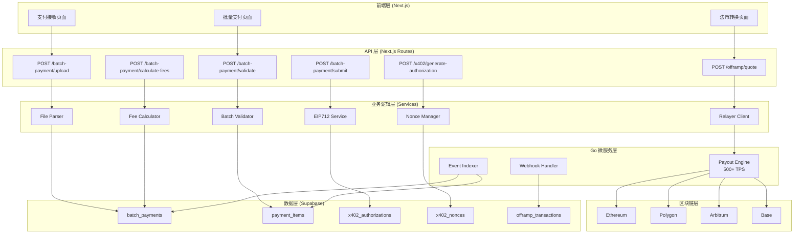

## 🔄 批量支付完整流程图

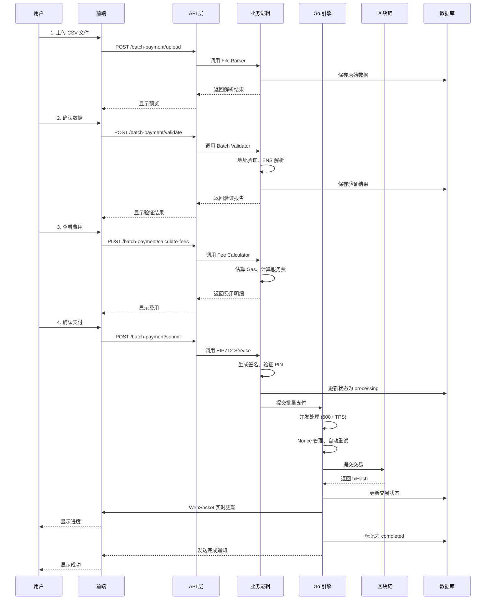

## 🔐 x402 Gasless 支付流程图

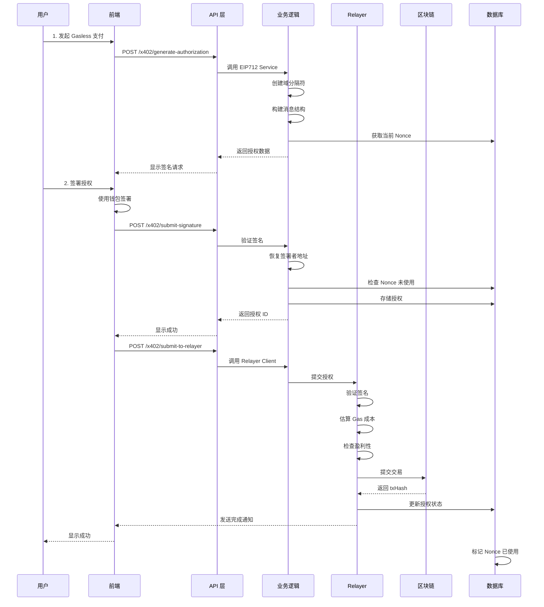

## 💰 Off-Ramp 法币转换流程图

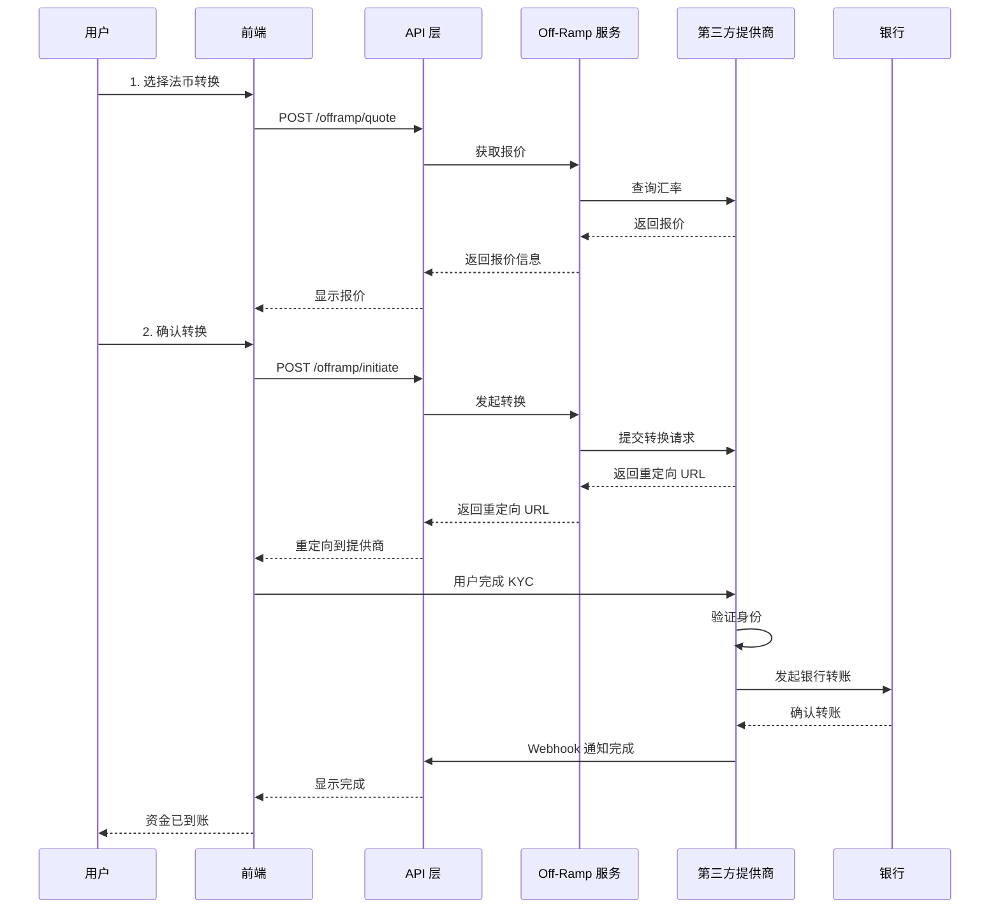

## 📊 数据流图

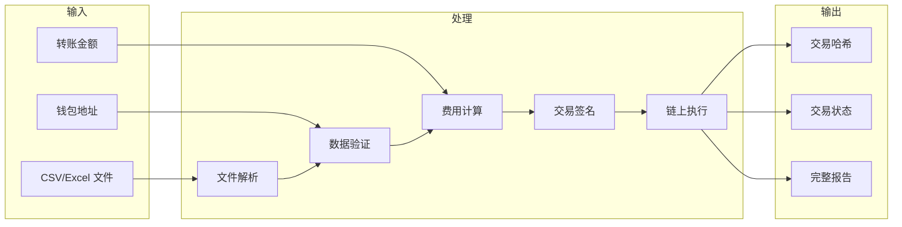

## 🔐 安全性流程图

```mermaid
graph TD
    subgraph KeyManagement["私钥管理"]
        PIN["用户 PIN"]
        PBKDF2["PBKDF2<br/>100,000 iterations"]
        AES["AES-256-GCM<br/>加密"]
        Shamir["Shamir 2-of-3<br/>分片"]
    end
    
    subgraph SigningProcess["签名过程"]
        Confirm["用户确认"]
        InputPIN["输入 PIN"]
        Reconstruct["重建私钥<br/>Share A + Share B"]
        Sign["签署交易"]
        Destroy["销毁私钥<br/>内存清零"]
    end
    
    subgraph ReplayProtection["防重放保护"]
        Nonce["唯一 Nonce"]
        Increment["Nonce 递增"]
        Store["存储已使用"]
        Verify["链上验证"]
    end
    
    PIN --> PBKDF2
    PBKDF2 --> AES
    AES --> Shamir
    
    Confirm --> InputPIN
    InputPIN --> Reconstruct
    Reconstruct --> Sign
    Sign --> Destroy
    
    Nonce --> Increment
    Increment --> Store
    Store --> Verify
```

## 🚀 性能优化架构

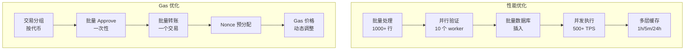

## 🔗 多链架构

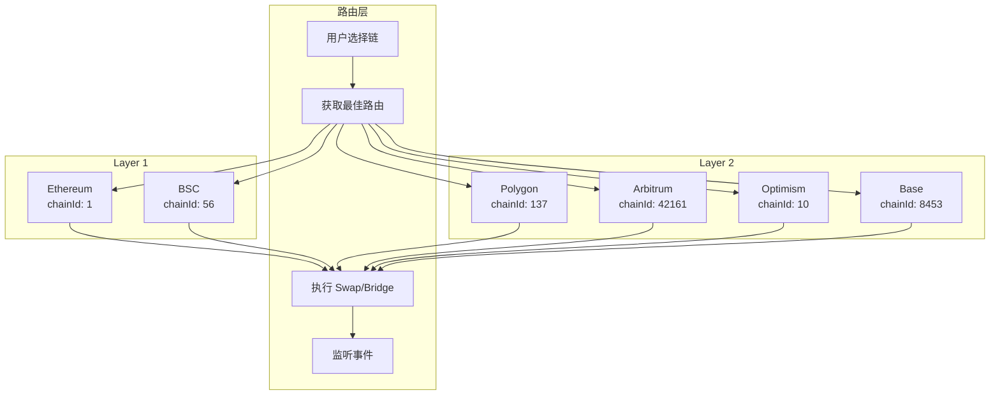

## 📈 实时监控架构

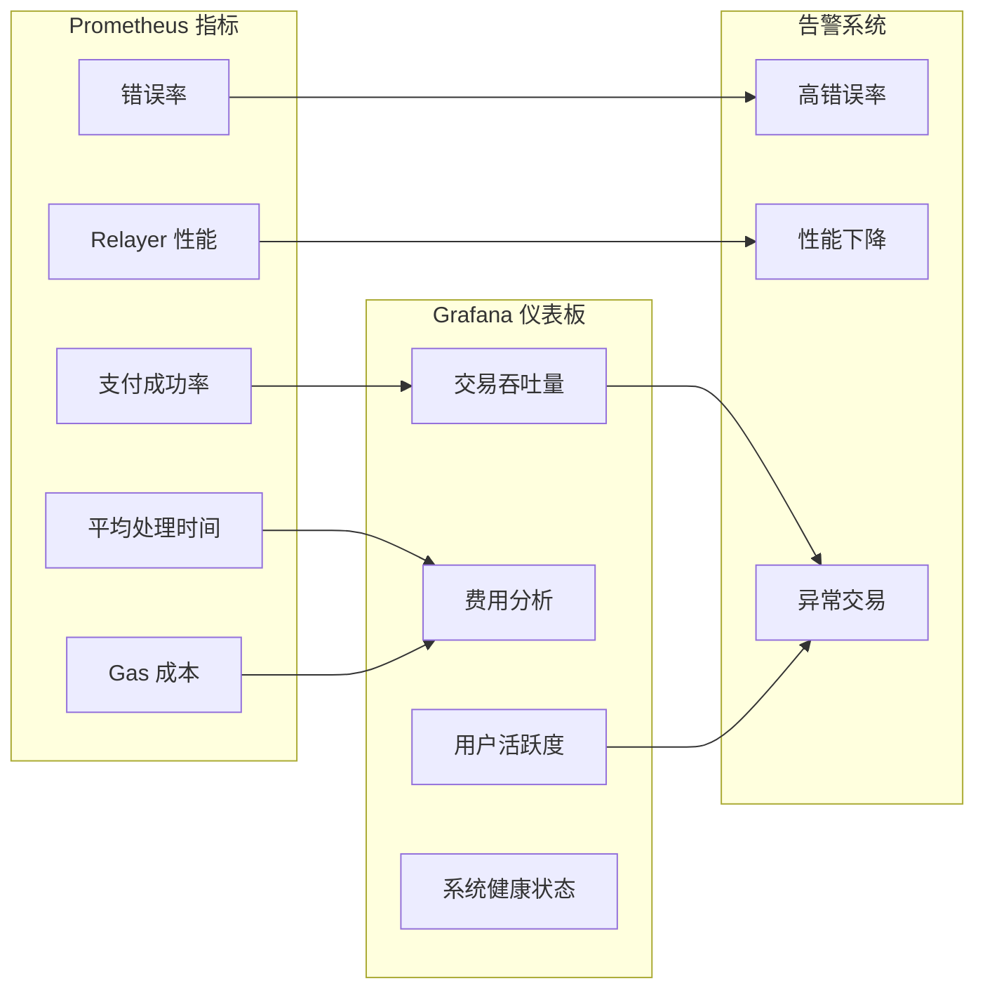

## 🗄️ 数据库关系图

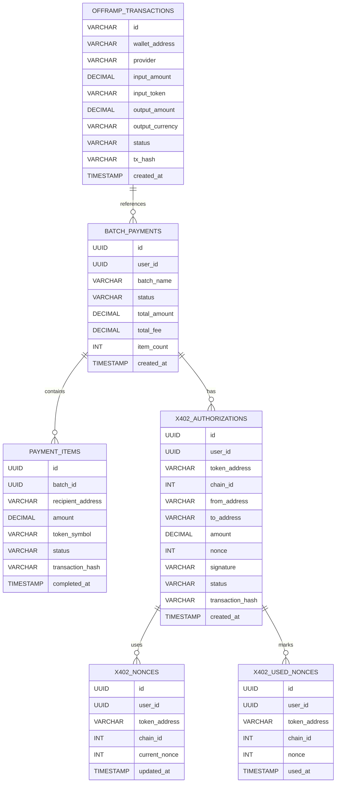

## 🎯 API 调用流程总结

```mermaid
graph TD
    subgraph BatchPayment["批量支付 API"]
        BP1["POST /upload"]
        BP2["POST /validate"]
        BP3["POST /calculate-fees"]
        BP4["POST /submit"]
        BP5["GET /:batchId/status"]
        BP6["GET /:batchId/report"]
    end
    
    subgraph X402["x402 Gasless API"]
        X1["POST /generate-authorization"]
        X2["POST /submit-signature"]
        X3["POST /submit-to-relayer"]
        X4["GET /:authId/status"]
    end
    
    subgraph OffRamp["Off-Ramp API"]
        O1["POST /quote"]
        O2["POST /initiate"]
    end
    
    BP1 --> BP2
    BP2 --> BP3
    BP3 --> BP4
    BP4 --> BP5
    BP5 --> BP6
    
    X1 --> X2
    X2 --> X3
    X3 --> X4
    
    O1 --> O2
```

---

## 📚 关键指标

| 指标 | 值 |
|------|-----|
| 吞吐量 | 500+ TPS |
| 平均延迟 | <3 秒 |
| 支付成功率 | >99.5% |
| Gas 优化 | 30-40% 节省 |
| 支持链数 | 6+ |
| 支持代币 | 100+ |
| 最大批量大小 | 10,000 项 |
| 费用 | 0.5% + Gas |

---

## 🔗 相关文件参考

- **前端**: `app/batch-payment/page.tsx`, `app/x402/page.tsx`, `app/offramp/page.tsx`
- **API**: `app/api/batch-payment/`, `app/api/x402/`, `app/api/offramp/`
- **服务**: `services/file-parser.service.ts`, `services/batch-validator.service.ts`, `services/fee-calculator.service.ts`, `services/eip712.service.ts`, `services/nonce-manager.service.ts`, `services/relayer-client.service.ts`
- **数据库**: `migrations/`
- **配置**: `lib/offramp.ts`
