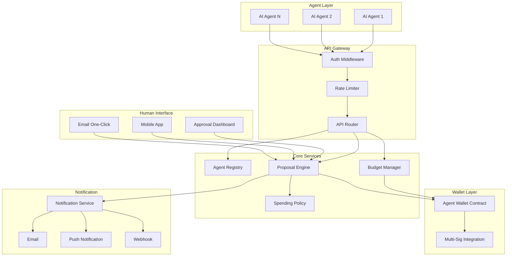

# Design Document: Agent Link API

## Overview

Agent Link API 是 ProtocolBanks 为 AI Agent 经济时代设计的核心基础设施。本设计提供完整的 Agent 身份管理、预算控制、支付提案和人类审批工作流，实现 Agent-to-Human 协作和 Agent-to-Agent 商业。

### 设计目标

1. **安全可控**: Agent 行为受人类监督，资金有明确边界
2. **语义丰富**: 支付携带业务上下文，便于人类理解和审批
3. **灵活策略**: 支持自动审批规则，平衡效率与安全
4. **可扩展性**: 支持大规模 Agent 部署和高并发请求

## Architecture

### 系统架构图



## Components and Interfaces

### 1. Agent Registry

```typescript
// lib/agent/registry.ts
interface AgentRegistry {
  // Agent 生命周期
  registerAgent(request: AgentRegistration): Promise<RegisteredAgent>;
  getAgent(agentId: string): Promise<Agent | null>;
  updateAgent(agentId: string, updates: AgentUpdate): Promise<Agent>;
  revokeAgent(agentId: string): Promise<void>;
  
  // 认证
  issueToken(agentId: string, apiKey: string, signature: string): Promise<AuthToken>;
  refreshToken(agentId: string, refreshToken: string): Promise<AuthToken>;
  validateToken(token: string): Promise<TokenValidation>;
  
  // 查询
  listAgentsByOwner(ownerAddress: string): Promise<Agent[]>;
  getAgentActivity(agentId: string, timeRange: TimeRange): Promise<ActivityLog[]>;
}

interface AgentRegistration {
  name: string;
  description: string;
  capabilities: string[];
  version: string;
  ownerSignature: string;  // EIP-712 签名
  rateLimits?: RateLimitConfig;
  ipWhitelist?: string[];
}

interface RegisteredAgent {
  id: string;
  apiKey: string;
  apiSecret: string;  // 仅返回一次
  walletAddress: string;  // Agent 专用钱包地址
  createdAt: Date;
}

interface AuthToken {
  accessToken: string;
  refreshToken: string;
  expiresAt: Date;
  agentId: string;
}
```

### 2. Budget Manager

```typescript
// lib/agent/budget.ts
interface BudgetManager {
  // 预算请求
  requestBudget(agentId: string, request: BudgetRequest): Promise<BudgetRequestResult>;
  approveBudget(requestId: string, approverSignature: string): Promise<Budget>;
  rejectBudget(requestId: string, reason: string): Promise<void>;
  
  // 预算查询
  getBudget(agentId: string): Promise<Budget | null>;
  getBudgetUtilization(agentId: string): Promise<BudgetUtilization>;
  
  // 预算操作
  replenishBudget(agentId: string, amount: string, token: string): Promise<Budget>;
  clawbackBudget(agentId: string): Promise<ClawbackResult>;
  freezeBudget(agentId: string): Promise<void>;
  unfreezeBudget(agentId: string): Promise<void>;
}

interface BudgetRequest {
  purpose: string;
  amount: string;
  token: string;
  duration: number;  // 秒
  spendingPolicy: SpendingPolicyConfig;
  renewalPolicy?: RenewalPolicy;
}

interface Budget {
  id: string;
  agentId: string;
  totalAmount: string;
  usedAmount: string;
  remainingAmount: string;
  token: string;
  status: 'active' | 'exhausted' | 'frozen' | 'expired';
  expiresAt: Date;
  spendingPolicy: SpendingPolicyConfig;
}

interface BudgetUtilization {
  daily: { used: string; limit: string };
  weekly: { used: string; limit: string };
  monthly: { used: string; limit: string };
  total: { used: string; limit: string };
  byCategory: Record<string, string>;
  byRecipient: Record<string, string>;
}
```

### 3. Proposal Engine

```typescript
// lib/agent/proposal.ts
interface ProposalEngine {
  // 提案生命周期
  createProposal(agentId: string, proposal: ProposalRequest): Promise<Proposal>;
  getProposal(proposalId: string): Promise<Proposal | null>;
  approveProposal(proposalId: string, approverAddress: string, signature: string): Promise<ExecutionResult>;
  rejectProposal(proposalId: string, approverAddress: string, reason: string): Promise<void>;
  
  // 批量操作
  createBatchProposal(agentId: string, proposals: ProposalRequest[]): Promise<BatchProposal>;
  
  // 查询
  listPendingProposals(ownerAddress: string): Promise<Proposal[]>;
  listProposalsByAgent(agentId: string): Promise<Proposal[]>;
}

interface ProposalRequest {
  recipient: string;
  amount: string;
  token: string;
  chain?: string;
  semanticContext: SemanticContext;
  attachments?: Attachment[];
  templateId?: string;
}

interface SemanticContext {
  type: 'invoice' | 'subscription' | 'service' | 'purchase' | 'refund' | 'other';
  humanReadable: string;      // "支付 AWS 12月账单"
  machineReadable: {          // 结构化数据
    invoiceId?: string;
    serviceProvider?: string;
    servicePeriod?: { start: Date; end: Date };
    category?: string;
    tags?: string[];
  };
  reasoning?: string;         // Agent 的决策理由
  urgency?: 'low' | 'medium' | 'high';
}

interface Proposal {
  id: string;
  agentId: string;
  agentName: string;
  status: 'pending' | 'approved' | 'rejected' | 'executed' | 'failed';
  recipient: string;
  amount: string;
  token: string;
  fees: { network: string; service: string; total: string };
  semanticContext: SemanticContext;
  requiredApprovals: number;
  currentApprovals: number;
  approvers: ApprovalRecord[];
  createdAt: Date;
  expiresAt: Date;
}
```

### 4. Spending Policy

```typescript
// lib/agent/policy.ts
interface SpendingPolicy {
  // 策略评估
  evaluateProposal(agentId: string, proposal: ProposalRequest): Promise<PolicyEvaluation>;
  
  // 策略管理
  createPolicy(agentId: string, policy: SpendingPolicyConfig): Promise<Policy>;
  updatePolicy(policyId: string, updates: PolicyUpdate): Promise<Policy>;
  getPolicy(agentId: string): Promise<Policy | null>;
  getPolicyHistory(agentId: string): Promise<PolicyVersion[]>;
  rollbackPolicy(agentId: string, version: number): Promise<Policy>;
}

interface SpendingPolicyConfig {
  // 自动审批规则
  autoApproval: {
    enabled: boolean;
    maxAmount: string;           // 单笔最大金额
    dailyLimit: string;          // 每日自动审批限额
    whitelistedRecipients: string[];
    allowedCategories: string[];
    timeRestrictions?: {
      allowedHours: { start: number; end: number };
      allowedDays: number[];     // 0-6, 0=Sunday
      timezone: string;
    };
  };
  
  // 限额
  limits: {
    perTransaction: string;
    daily: string;
    weekly: string;
    monthly: string;
  };
  
  // 多签要求
  multiSig?: {
    threshold: number;
    approvers: string[];
    highValueThreshold: string;  // 超过此金额需要多签
  };
}

interface PolicyEvaluation {
  allowed: boolean;
  autoApproved: boolean;
  violations: PolicyViolation[];
  requiredApprovals: number;
}

interface PolicyViolation {
  rule: string;
  message: string;
  severity: 'warning' | 'error';
}
```

## Data Models

### Database Schema

```sql
-- Agent 注册表
CREATE TABLE agents (
  id UUID PRIMARY KEY DEFAULT gen_random_uuid(),
  name TEXT NOT NULL,
  description TEXT,
  capabilities TEXT[],
  version TEXT,
  owner_address TEXT NOT NULL,
  wallet_address TEXT NOT NULL UNIQUE,
  api_key_hash TEXT NOT NULL,
  api_secret_hash TEXT NOT NULL,
  status TEXT DEFAULT 'active',
  rate_limit_config JSONB,
  ip_whitelist TEXT[],
  created_at TIMESTAMPTZ DEFAULT NOW(),
  revoked_at TIMESTAMPTZ
);

-- Agent 预算表
CREATE TABLE agent_budgets (
  id UUID PRIMARY KEY DEFAULT gen_random_uuid(),
  agent_id UUID REFERENCES agents(id),
  total_amount DECIMAL(36, 18) NOT NULL,
  used_amount DECIMAL(36, 18) DEFAULT 0,
  token TEXT NOT NULL,
  status TEXT DEFAULT 'active',
  spending_policy JSONB NOT NULL,
  renewal_policy JSONB,
  expires_at TIMESTAMPTZ NOT NULL,
  created_at TIMESTAMPTZ DEFAULT NOW(),
  updated_at TIMESTAMPTZ DEFAULT NOW()
);

-- 预算请求表
CREATE TABLE budget_requests (
  id UUID PRIMARY KEY DEFAULT gen_random_uuid(),
  agent_id UUID REFERENCES agents(id),
  purpose TEXT NOT NULL,
  amount DECIMAL(36, 18) NOT NULL,
  token TEXT NOT NULL,
  duration INTEGER NOT NULL,
  spending_policy JSONB NOT NULL,
  status TEXT DEFAULT 'pending',
  approved_by TEXT,
  rejected_reason TEXT,
  created_at TIMESTAMPTZ DEFAULT NOW(),
  resolved_at TIMESTAMPTZ
);

-- 支付提案表
CREATE TABLE proposals (
  id UUID PRIMARY KEY DEFAULT gen_random_uuid(),
  agent_id UUID REFERENCES agents(id),
  batch_id UUID,
  recipient TEXT NOT NULL,
  amount DECIMAL(36, 18) NOT NULL,
  token TEXT NOT NULL,
  chain TEXT,
  semantic_context JSONB NOT NULL,
  attachments JSONB,
  status TEXT DEFAULT 'pending',
  required_approvals INTEGER DEFAULT 1,
  current_approvals INTEGER DEFAULT 0,
  auto_approved BOOLEAN DEFAULT FALSE,
  fees JSONB,
  tx_hash TEXT,
  created_at TIMESTAMPTZ DEFAULT NOW(),
  expires_at TIMESTAMPTZ,
  executed_at TIMESTAMPTZ
);

-- 审批记录表
CREATE TABLE proposal_approvals (
  id UUID PRIMARY KEY DEFAULT gen_random_uuid(),
  proposal_id UUID REFERENCES proposals(id),
  approver_address TEXT NOT NULL,
  action TEXT NOT NULL,  -- 'approve' | 'reject'
  signature TEXT,
  reason TEXT,
  created_at TIMESTAMPTZ DEFAULT NOW()
);

-- 消费策略版本表
CREATE TABLE spending_policies (
  id UUID PRIMARY KEY DEFAULT gen_random_uuid(),
  agent_id UUID REFERENCES agents(id),
  version INTEGER NOT NULL,
  config JSONB NOT NULL,
  created_at TIMESTAMPTZ DEFAULT NOW(),
  created_by TEXT NOT NULL,
  
  UNIQUE(agent_id, version)
);

-- Agent 活动日志
CREATE TABLE agent_activity_logs (
  id UUID PRIMARY KEY DEFAULT gen_random_uuid(),
  agent_id UUID REFERENCES agents(id),
  action TEXT NOT NULL,
  details JSONB,
  ip_address INET,
  created_at TIMESTAMPTZ DEFAULT NOW()
);

-- 索引
CREATE INDEX idx_agents_owner ON agents(owner_address);
CREATE INDEX idx_budgets_agent ON agent_budgets(agent_id);
CREATE INDEX idx_proposals_agent ON proposals(agent_id);
CREATE INDEX idx_proposals_status ON proposals(status);
CREATE INDEX idx_activity_agent ON agent_activity_logs(agent_id, created_at);

-- RLS 策略
ALTER TABLE agents ENABLE ROW LEVEL SECURITY;
ALTER TABLE agent_budgets ENABLE ROW LEVEL SECURITY;
ALTER TABLE proposals ENABLE ROW LEVEL SECURITY;

CREATE POLICY "Owners can view own agents" ON agents
  FOR SELECT USING (owner_address = current_setting('app.current_user_address', true));

CREATE POLICY "Owners can manage own agents" ON agents
  FOR ALL USING (owner_address = current_setting('app.current_user_address', true));
```

## Correctness Properties

*A property is a characteristic or behavior that should hold true across all valid executions of a system—essentially, a formal statement about what the system should do.*

### Property 1: Agent ID Uniqueness

*For any* two registered Agents, their Agent IDs SHALL be unique across the entire system.

**Validates: Requirements 1.1**

### Property 2: Agent Registration Integrity

*For any* registered Agent, the registration SHALL require a valid owner wallet signature, and the Agent SHALL be associated with exactly one owner wallet address.

**Validates: Requirements 1.2, 1.3**

### Property 3: Credential Revocation Immediacy

*For any* revoked Agent credentials, all subsequent API requests using those credentials SHALL be rejected immediately.

**Validates: Requirements 1.5**

### Property 4: Rate Limiting Enforcement

*For any* Agent exceeding its configured rate limit, subsequent requests SHALL be rejected until the rate limit window resets.

**Validates: Requirements 1.6, 7.6**

### Property 5: Audit Logging Completeness

*For any* Agent activity (registration, budget request, proposal, approval), there SHALL exist a corresponding audit log entry.

**Validates: Requirements 1.7, 5.6**

### Property 6: Budget Request Validation

*For any* budget request, the request SHALL contain purpose, amount, duration, and spending policy, or be rejected with specific missing field errors.

**Validates: Requirements 2.1, 2.2**

### Property 7: Budget Allocation on Approval

*For any* approved budget request, funds SHALL be allocated to the Agent wallet within the same transaction.

**Validates: Requirements 2.3**

### Property 8: Budget Limit Enforcement

*For any* spending attempt that would exceed budget limits (daily, weekly, monthly, or total), the transaction SHALL be rejected.

**Validates: Requirements 2.4, 2.5, 6.3**

### Property 9: Budget Balance Validation

*For any* budget request where the requested amount exceeds the owner's available balance, the request SHALL be rejected.

**Validates: Requirements 2.7**

### Property 10: Budget Utilization Accuracy

*For any* budget, the sum of all executed transactions SHALL equal the used amount, and remaining amount SHALL equal total minus used.

**Validates: Requirements 2.8**

### Property 11: Semantic Context Required

*For any* payment proposal, the proposal SHALL contain both human-readable and machine-readable semantic context, or be rejected.

**Validates: Requirements 3.1, 3.6**

### Property 12: Policy Validation

*For any* proposal that violates the Agent's spending policy, the proposal SHALL be rejected with specific violation details.

**Validates: Requirements 3.2, 3.3**

### Property 13: Batch Proposal Atomicity

*For any* batch proposal, either all payments in the batch SHALL succeed, or none SHALL be executed.

**Validates: Requirements 3.4**

### Property 14: Fee Calculation Accuracy

*For any* proposal, the displayed total cost SHALL equal the payment amount plus all fees (network + service).

**Validates: Requirements 3.5**

### Property 15: Approver Notification

*For any* submitted proposal requiring human approval, all designated approvers SHALL receive a notification.

**Validates: Requirements 4.1**

### Property 16: Proposal Display Completeness

*For any* proposal displayed to approvers, the display SHALL include semantic context, amount, recipient, token, and Agent reasoning.

**Validates: Requirements 4.2**

### Property 17: Approval Triggers Execution

*For any* proposal that receives sufficient approvals, the payment SHALL be executed immediately.

**Validates: Requirements 4.3**

### Property 18: Rejection Notification

*For any* rejected proposal, the Agent SHALL receive a notification containing the rejection reason.

**Validates: Requirements 4.4**

### Property 19: Multi-Sig Threshold

*For any* proposal requiring multi-sig approval, the proposal SHALL NOT execute until the required number of approvals is reached.

**Validates: Requirements 4.5**

### Property 20: Approval Delegation

*For any* delegated approval, the delegate's approval SHALL have the same effect as the delegator's approval.

**Validates: Requirements 4.7**

### Property 21: Auto-Approval Rules

*For any* proposal matching all auto-approval criteria (amount below threshold, whitelisted recipient, allowed category, within time restrictions), the proposal SHALL be executed without human review.

**Validates: Requirements 5.1, 5.2, 5.3, 5.4, 5.5**

### Property 22: Conflicting Rules Resolution

*For any* proposal where auto-approval rules conflict, the most restrictive rule SHALL be applied.

**Validates: Requirements 5.8**

### Property 23: Policy Versioning

*For any* policy update, the previous version SHALL be preserved and rollback SHALL restore the exact previous configuration.

**Validates: Requirements 5.7**

### Property 24: Spending Restriction

*For any* Agent wallet spending, the recipient SHALL be either on the whitelist or within the spending policy parameters.

**Validates: Requirements 6.2**

### Property 25: Emergency Freeze

*For any* frozen Agent wallet, all spending transactions SHALL be rejected until unfrozen by the owner.

**Validates: Requirements 6.4**

### Property 26: Fund Clawback

*For any* clawback operation, all remaining funds in the Agent wallet SHALL be returned to the owner's wallet.

**Validates: Requirements 6.5**

### Property 27: Transaction Event Emission

*For any* Agent wallet transaction, an event SHALL be emitted containing transaction details.

**Validates: Requirements 6.6**

### Property 28: Multi-Token Support

*For any* supported token (ETH, USDC, USDT), the Agent wallet SHALL correctly handle deposits, spending, and balance queries.

**Validates: Requirements 6.7**

### Property 29: API Authentication

*For any* API request, valid JWT token with non-expired timestamp SHALL be required, and invalid/expired tokens SHALL return 401.

**Validates: Requirements 7.1, 7.2, 7.3**

### Property 30: IP Whitelist Enforcement

*For any* Agent with IP whitelist configured, requests from non-whitelisted IPs SHALL be rejected.

**Validates: Requirements 7.4**

### Property 31: Request Signing Verification

*For any* API request requiring signing, invalid HMAC-SHA256 signatures SHALL be rejected.

**Validates: Requirements 7.5**

### Property 32: Suspicious Pattern Detection

*For any* Agent exhibiting suspicious patterns (rapid credential rotation, unusual request patterns), the account SHALL be flagged for review.

**Validates: Requirements 7.7**

### Property 33: Webhook Signature

*For any* webhook callback, the payload SHALL include a valid HMAC signature that the recipient can verify.

**Validates: Requirements 7.8**

## Error Handling

### Error Code System

```typescript
// lib/agent/errors.ts
enum AgentLinkErrorCode {
  // Registration Errors (1xxx)
  REGISTRATION_FAILED = 'AGENT_1001',
  INVALID_SIGNATURE = 'AGENT_1002',
  AGENT_EXISTS = 'AGENT_1003',
  AGENT_NOT_FOUND = 'AGENT_1004',
  AGENT_REVOKED = 'AGENT_1005',
  
  // Authentication Errors (2xxx)
  AUTH_FAILED = 'AGENT_2001',
  TOKEN_EXPIRED = 'AGENT_2002',
  TOKEN_INVALID = 'AGENT_2003',
  IP_NOT_WHITELISTED = 'AGENT_2004',
  SIGNATURE_INVALID = 'AGENT_2005',
  RATE_LIMITED = 'AGENT_2006',
  
  // Budget Errors (3xxx)
  BUDGET_NOT_FOUND = 'AGENT_3001',
  BUDGET_EXHAUSTED = 'AGENT_3002',
  BUDGET_FROZEN = 'AGENT_3003',
  BUDGET_EXPIRED = 'AGENT_3004',
  INSUFFICIENT_OWNER_BALANCE = 'AGENT_3005',
  INVALID_BUDGET_REQUEST = 'AGENT_3006',
  
  // Proposal Errors (4xxx)
  PROPOSAL_NOT_FOUND = 'AGENT_4001',
  PROPOSAL_EXPIRED = 'AGENT_4002',
  POLICY_VIOLATION = 'AGENT_4003',
  MISSING_SEMANTIC_CONTEXT = 'AGENT_4004',
  EXECUTION_FAILED = 'AGENT_4005',
  ALREADY_APPROVED = 'AGENT_4006',
  NOT_AUTHORIZED_APPROVER = 'AGENT_4007',
  
  // Wallet Errors (5xxx)
  WALLET_FROZEN = 'AGENT_5001',
  SPENDING_LIMIT_EXCEEDED = 'AGENT_5002',
  RECIPIENT_NOT_ALLOWED = 'AGENT_5003',
  CLAWBACK_FAILED = 'AGENT_5004',
  
  // System Errors (9xxx)
  INTERNAL_ERROR = 'AGENT_9999',
}
```

## Testing Strategy

### Unit Tests

- Agent ID generation uniqueness
- Signature verification
- Budget calculation accuracy
- Policy evaluation logic
- Fee calculation

### Property-Based Tests

Using `fast-check` library:

```typescript
import fc from 'fast-check';

// Property 10: Budget Utilization Accuracy
describe('Budget Utilization', () => {
  it('should maintain accurate utilization tracking', () => {
    fc.assert(
      fc.property(
        fc.array(fc.float({ min: 0.01, max: 1000 }), { minLength: 1, maxLength: 100 }),
        fc.float({ min: 1000, max: 100000 }),
        (transactions, totalBudget) => {
          const budget = createBudget(totalBudget);
          let expectedUsed = 0;
          
          for (const amount of transactions) {
            if (expectedUsed + amount <= totalBudget) {
              executeTransaction(budget, amount);
              expectedUsed += amount;
            }
          }
          
          return (
            Math.abs(budget.usedAmount - expectedUsed) < 0.001 &&
            Math.abs(budget.remainingAmount - (totalBudget - expectedUsed)) < 0.001
          );
        }
      ),
      { numRuns: 100 }
    );
  });
});

// Property 21: Auto-Approval Rules
describe('Auto-Approval', () => {
  it('should auto-approve matching proposals', () => {
    fc.assert(
      fc.property(
        fc.float({ min: 0.01, max: 100 }),  // Below threshold
        fc.constantFrom(...whitelistedRecipients),
        fc.constantFrom(...allowedCategories),
        (amount, recipient, category) => {
          const proposal = createProposal({ amount, recipient, category });
          const evaluation = evaluatePolicy(proposal, autoApprovalPolicy);
          return evaluation.autoApproved === true;
        }
      ),
      { numRuns: 100 }
    );
  });
});
```

### Integration Tests

- Full Agent registration flow
- Budget request and approval flow
- Proposal creation and execution flow
- Multi-sig approval flow
- Webhook delivery verification

### Test Configuration

- Property tests: minimum 100 iterations
- Test tag format: `Feature: agent-link-api, Property N: {property_text}`
- Use mock blockchain for wallet tests
