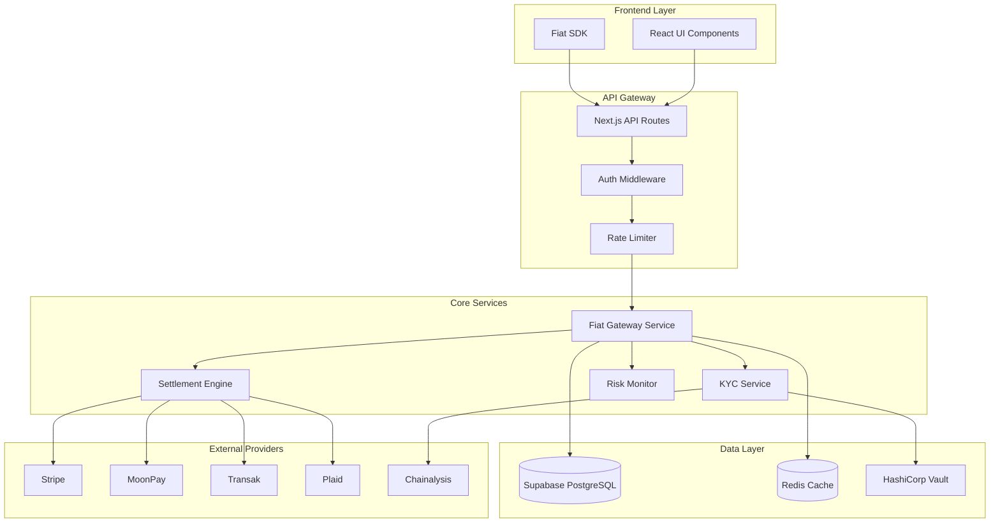

# Design Document: Fiat On/Off Ramp

## Overview

法币出入金系统是 ProtocolBanks 连接传统金融与加密世界的桥梁。本设计采用模块化架构，集成多个第三方支付服务商，提供合规、安全、高效的法币-加密货币兑换服务。

### 设计目标

1. **合规优先**: 满足全球主要市场的 KYC/AML 要求
2. **用户体验**: 简化入金流程，支持多种支付方式
3. **安全可靠**: 资金安全、数据加密、审计完整
4. **可扩展性**: 支持新增支付渠道和币种

## Architecture

### 系统架构图



### 服务职责

| 服务 | 职责 |
|------|------|
| Fiat Gateway | 统一入口，路由请求，聚合报价 |
| KYC Service | 身份验证，文档处理，制裁筛查 |
| Settlement Engine | 订单执行，资金结算，银行对接 |
| Risk Monitor | 交易监控，欺诈检测，合规报告 |

## Components and Interfaces

### 1. Fiat Gateway Service

```typescript
// lib/fiat/gateway.ts
interface FiatGateway {
  // 获取报价
  getQuote(request: QuoteRequest): Promise<Quote>;
  
  // 执行入金
  executeOnRamp(order: OnRampOrder): Promise<Transaction>;
  
  // 执行出金
  executeOffRamp(order: OffRampOrder): Promise<Transaction>;
  
  // 获取交易状态
  getTransactionStatus(txId: string): Promise<TransactionStatus>;
  
  // 获取支持的币种
  getSupportedAssets(): Promise<Asset[]>;
  
  // 获取支持的法币
  getSupportedFiatCurrencies(): Promise<FiatCurrency[]>;
}

interface QuoteRequest {
  fromCurrency: string;      // "USD" or "BTC"
  toCurrency: string;        // "BTC" or "USD"
  amount: string;            // Amount in source currency
  paymentMethod: PaymentMethod;
  chain?: string;            // Target chain for crypto
}

interface Quote {
  id: string;
  fromAmount: string;
  toAmount: string;
  exchangeRate: string;
  fees: {
    networkFee: string;
    serviceFee: string;
    totalFee: string;
  };
  expiresAt: Date;
  provider: string;
}
```

### 2. KYC Service

```typescript
// lib/fiat/kyc.ts
interface KYCService {
  // 获取用户 KYC 状态
  getKYCStatus(userId: string): Promise<KYCStatus>;
  
  // 提交 KYC 文档
  submitDocuments(userId: string, docs: KYCDocuments): Promise<KYCSubmission>;
  
  // 验证银行账户
  verifyBankAccount(userId: string, account: BankAccount): Promise<BankVerification>;
  
  // 制裁筛查
  screenSanctions(userId: string, data: ScreeningData): Promise<ScreeningResult>;
}

interface KYCStatus {
  level: 'none' | 'pending' | 'level1' | 'level2' | 'rejected';
  limits: {
    dailyLimit: string;
    monthlyLimit: string;
    singleTxLimit: string;
  };
  rejectionReason?: string;
  submittedAt?: Date;
  verifiedAt?: Date;
}

interface KYCDocuments {
  idType: 'passport' | 'drivers_license' | 'national_id';
  idFront: File;
  idBack?: File;
  selfie: File;
  proofOfAddress?: File;
}
```

### 3. Settlement Engine

```typescript
// lib/fiat/settlement.ts
interface SettlementEngine {
  // 处理卡支付
  processCardPayment(payment: CardPayment): Promise<PaymentResult>;
  
  // 生成银行转账指令
  generateBankInstructions(request: BankTransferRequest): Promise<BankInstructions>;
  
  // 处理银行入账
  processIncomingTransfer(transfer: IncomingTransfer): Promise<CreditResult>;
  
  // 执行出金
  executeWithdrawal(withdrawal: WithdrawalRequest): Promise<WithdrawalResult>;
  
  // 批量处理小额出金
  batchWithdrawals(withdrawals: WithdrawalRequest[]): Promise<BatchResult>;
}

interface CardPayment {
  userId: string;
  amount: string;
  currency: string;
  cardToken: string;  // Tokenized card, never raw numbers
  threeDSecure?: ThreeDSecureData;
}

interface BankInstructions {
  referenceCode: string;
  bankName: string;
  accountNumber: string;
  routingNumber?: string;
  iban?: string;
  swiftCode?: string;
  amount: string;
  currency: string;
  expiresAt: Date;
}
```

### 4. Risk Monitor

```typescript
// lib/fiat/risk.ts
interface RiskMonitor {
  // 评估交易风险
  assessTransaction(tx: Transaction): Promise<RiskAssessment>;
  
  // 检测可疑模式
  detectSuspiciousPatterns(userId: string): Promise<PatternResult>;
  
  // 生成合规报告
  generateComplianceReport(type: ReportType, params: ReportParams): Promise<Report>;
  
  // 记录审计日志
  logAuditEvent(event: AuditEvent): Promise<void>;
}

interface RiskAssessment {
  score: number;           // 0-100, higher = riskier
  flags: RiskFlag[];
  action: 'approve' | 'review' | 'block';
  reasons: string[];
}

type RiskFlag = 
  | 'high_velocity'        // 短时间内多笔交易
  | 'limit_circumvention'  // 尝试绕过限额
  | 'sanctioned_entity'    // 制裁名单匹配
  | 'unusual_pattern'      // 异常交易模式
  | 'new_account'          // 新账户大额交易
  | 'geographic_risk';     // 高风险地区
```

## Data Models

### Database Schema

```sql
-- KYC 用户表
CREATE TABLE kyc_users (
  id UUID PRIMARY KEY DEFAULT gen_random_uuid(),
  user_id UUID REFERENCES auth_users(id),
  wallet_address TEXT NOT NULL,
  kyc_level TEXT DEFAULT 'none',
  status TEXT DEFAULT 'pending',
  rejection_reason TEXT,
  submitted_at TIMESTAMPTZ,
  verified_at TIMESTAMPTZ,
  created_at TIMESTAMPTZ DEFAULT NOW(),
  updated_at TIMESTAMPTZ DEFAULT NOW()
);

-- KYC 文档表 (加密存储)
CREATE TABLE kyc_documents (
  id UUID PRIMARY KEY DEFAULT gen_random_uuid(),
  kyc_user_id UUID REFERENCES kyc_users(id),
  document_type TEXT NOT NULL,
  encrypted_data BYTEA NOT NULL,  -- AES-256-GCM 加密
  iv BYTEA NOT NULL,
  hash TEXT NOT NULL,  -- 用于验证完整性
  created_at TIMESTAMPTZ DEFAULT NOW()
);

-- 法币交易表
CREATE TABLE fiat_transactions (
  id UUID PRIMARY KEY DEFAULT gen_random_uuid(),
  user_id UUID REFERENCES auth_users(id),
  wallet_address TEXT NOT NULL,
  type TEXT NOT NULL,  -- 'on_ramp' | 'off_ramp'
  status TEXT DEFAULT 'pending',
  fiat_currency TEXT NOT NULL,
  fiat_amount DECIMAL(20, 8) NOT NULL,
  crypto_currency TEXT NOT NULL,
  crypto_amount DECIMAL(20, 8),
  chain TEXT,
  exchange_rate DECIMAL(20, 8),
  fees JSONB,
  payment_method TEXT,
  provider TEXT,
  provider_tx_id TEXT,
  risk_score INTEGER,
  risk_flags TEXT[],
  created_at TIMESTAMPTZ DEFAULT NOW(),
  completed_at TIMESTAMPTZ
);

-- 银行账户表
CREATE TABLE bank_accounts (
  id UUID PRIMARY KEY DEFAULT gen_random_uuid(),
  user_id UUID REFERENCES auth_users(id),
  account_holder_name TEXT NOT NULL,
  bank_name TEXT NOT NULL,
  account_number_encrypted BYTEA NOT NULL,
  routing_number TEXT,
  iban TEXT,
  swift_code TEXT,
  currency TEXT NOT NULL,
  is_verified BOOLEAN DEFAULT FALSE,
  verification_method TEXT,
  created_at TIMESTAMPTZ DEFAULT NOW()
);

-- 审计日志表
CREATE TABLE fiat_audit_logs (
  id UUID PRIMARY KEY DEFAULT gen_random_uuid(),
  user_id UUID,
  wallet_address TEXT,
  action TEXT NOT NULL,
  target_type TEXT,
  target_id UUID,
  details JSONB,
  ip_address INET,
  user_agent TEXT,
  created_at TIMESTAMPTZ DEFAULT NOW()
);

-- RLS 策略
ALTER TABLE kyc_users ENABLE ROW LEVEL SECURITY;
ALTER TABLE fiat_transactions ENABLE ROW LEVEL SECURITY;
ALTER TABLE bank_accounts ENABLE ROW LEVEL SECURITY;

CREATE POLICY "Users can view own KYC" ON kyc_users
  FOR SELECT USING (wallet_address = current_setting('app.current_user_address', true));

CREATE POLICY "Users can view own transactions" ON fiat_transactions
  FOR SELECT USING (wallet_address = current_setting('app.current_user_address', true));
```

## Correctness Properties

*A property is a characteristic or behavior that should hold true across all valid executions of a system—essentially, a formal statement about what the system should do. Properties serve as the bridge between human-readable specifications and machine-verifiable correctness guarantees.*

### Property 1: KYC Data Encryption Round Trip

*For any* KYC document data, encrypting with AES-256-GCM then decrypting with the same key SHALL produce the original document data.

**Validates: Requirements 1.7**

### Property 2: Transaction Limits by KYC Tier

*For any* user with a given KYC level, all transaction attempts exceeding the tier limit SHALL be rejected, and all attempts within the limit SHALL be allowed (assuming sufficient balance).

| KYC Level | Daily Limit |
|-----------|-------------|
| none/pending | $100 |
| level1 | $10,000 |
| level2 | $50,000 |

**Validates: Requirements 1.3, 1.4, 2.8**

### Property 3: KYC Rejection Provides Reason

*For any* KYC verification that results in rejection, the response SHALL contain a non-empty rejection reason code from the defined set of reason codes.

**Validates: Requirements 1.5**

### Property 4: Card Tokenization Security

*For any* card payment processed through the system, the stored payment record SHALL NOT contain raw card numbers (only tokenized references).

**Validates: Requirements 2.2**

### Property 5: Exchange Rate Spread Limit

*For any* quote generated by the Fiat Gateway, the spread between the offered rate and the market rate (from CoinGecko) SHALL NOT exceed 2%.

**Validates: Requirements 2.4**

### Property 6: Payment Error Handling

*For any* failed payment attempt, the response SHALL contain a standardized error code and a human-readable description.

**Validates: Requirements 2.6**

### Property 7: Unique Reference Code Generation

*For any* two bank transfer instructions generated by the system, their reference codes SHALL be unique (no collisions).

**Validates: Requirements 3.1**

### Property 8: Deposit Matching Algorithm

*For any* incoming bank transfer without a reference code, if the amount and sender match exactly one pending deposit instruction, the system SHALL correctly match and credit the user.

**Validates: Requirements 3.6**

### Property 9: Bank Transfer Fee Calculation

*For any* bank transfer amount, the calculated fee SHALL equal max(min(amount * 0.005, $50), $1).

**Validates: Requirements 3.7**

### Property 10: Rate Lock Validity

*For any* confirmed sell order, the locked exchange rate SHALL remain valid for exactly 60 seconds, after which the quote SHALL expire.

**Validates: Requirements 4.2**

### Property 11: Verified Account Withdrawal Only

*For any* withdrawal request to a bank account, the request SHALL be rejected if the bank account is not verified.

**Validates: Requirements 4.4**

### Property 12: Large Withdrawal Verification

*For any* withdrawal request exceeding $10,000, the system SHALL require additional verification before processing.

**Validates: Requirements 4.6**

### Property 13: Withdrawal Batching

*For any* set of pending withdrawals under $100 each, the Settlement Engine SHALL batch them into a single bank transfer when the batch reaches 10 items or 24 hours have passed.

**Validates: Requirements 4.8**

### Property 14: Fee Transparency

*For any* quote or transaction receipt, the response SHALL contain separate fields for exchange_rate, network_fee, and service_fee.

**Validates: Requirements 5.1, 5.4**

### Property 15: Quote Staleness Detection

*For any* quote where the current market rate has changed by more than 1% since quote creation, the quote SHALL be marked as stale and require refresh.

**Validates: Requirements 5.2**

### Property 16: Price Alert Triggering

*For any* price alert where the current rate meets or exceeds the target rate, the system SHALL trigger a notification within 1 minute.

**Validates: Requirements 5.6**

### Property 17: Currency Fallback

*For any* transaction request where the user's preferred fiat currency is unavailable, the system SHALL offer USD as fallback with disclosed conversion rate.

**Validates: Requirements 6.5**

### Property 18: Sanctions Compliance

*For any* user or transaction involving an entity on OFAC, EU, or UN sanctions lists, the system SHALL block the transaction and flag the account.

**Validates: Requirements 7.3, 7.6**

### Property 19: Risk Detection and Flagging

*For any* transaction that matches defined suspicious patterns (high velocity, limit circumvention, unusual amounts), the system SHALL assign a risk score > 70 and hold for review.

**Validates: Requirements 7.1, 7.2, 7.7**

### Property 20: Audit Trail Completeness

*For any* fiat transaction (on-ramp or off-ramp), there SHALL exist a corresponding audit log entry with user_id, action, amount, and timestamp.

**Validates: Requirements 7.4**

### Property 21: Regulatory Report Generation

*For any* transaction meeting CTR threshold ($10,000+) or SAR criteria, the system SHALL generate the appropriate report within 24 hours.

**Validates: Requirements 7.5**

### Property 22: Webhook Delivery

*For any* transaction status change, a webhook SHALL be sent to all registered endpoints within 30 seconds.

**Validates: Requirements 8.2**

### Property 23: API Access Control

*For any* API request, if the source IP is not in the API key's whitelist OR the request count exceeds 100/minute, the request SHALL be rejected with appropriate error.

**Validates: Requirements 8.3, 8.5**

### Property 24: API Error Format

*For any* API error response, the response body SHALL contain `error_code` (string), `message` (string), and `details` (object) fields.

**Validates: Requirements 8.7**

## Error Handling

### Error Code System

```typescript
// lib/fiat/errors.ts
enum FiatErrorCode {
  // KYC Errors (1xxx)
  KYC_REQUIRED = 'FIAT_1001',
  KYC_PENDING = 'FIAT_1002',
  KYC_REJECTED = 'FIAT_1003',
  KYC_DOCUMENT_INVALID = 'FIAT_1004',
  KYC_DOCUMENT_EXPIRED = 'FIAT_1005',
  
  // Payment Errors (2xxx)
  PAYMENT_DECLINED = 'FIAT_2001',
  PAYMENT_INSUFFICIENT_FUNDS = 'FIAT_2002',
  PAYMENT_CARD_EXPIRED = 'FIAT_2003',
  PAYMENT_3DS_FAILED = 'FIAT_2004',
  PAYMENT_LIMIT_EXCEEDED = 'FIAT_2005',
  
  // Quote Errors (3xxx)
  QUOTE_EXPIRED = 'FIAT_3001',
  QUOTE_RATE_CHANGED = 'FIAT_3002',
  QUOTE_AMOUNT_TOO_LOW = 'FIAT_3003',
  QUOTE_AMOUNT_TOO_HIGH = 'FIAT_3004',
  
  // Withdrawal Errors (4xxx)
  WITHDRAWAL_ACCOUNT_NOT_VERIFIED = 'FIAT_4001',
  WITHDRAWAL_INSUFFICIENT_BALANCE = 'FIAT_4002',
  WITHDRAWAL_LIMIT_EXCEEDED = 'FIAT_4003',
  WITHDRAWAL_VERIFICATION_REQUIRED = 'FIAT_4004',
  
  // Compliance Errors (5xxx)
  COMPLIANCE_SANCTIONED = 'FIAT_5001',
  COMPLIANCE_HIGH_RISK = 'FIAT_5002',
  COMPLIANCE_JURISDICTION_BLOCKED = 'FIAT_5003',
  
  // System Errors (9xxx)
  PROVIDER_UNAVAILABLE = 'FIAT_9001',
  RATE_LIMIT_EXCEEDED = 'FIAT_9002',
  INTERNAL_ERROR = 'FIAT_9999',
}

interface FiatError {
  code: FiatErrorCode;
  message: string;
  details?: Record<string, unknown>;
  retryable: boolean;
  suggestedAction?: string;
}
```

### Error Recovery Strategies

| Error Type | Recovery Strategy |
|------------|-------------------|
| Quote Expired | Auto-refresh quote, re-confirm |
| Payment Declined | Suggest alternative payment method |
| KYC Required | Redirect to KYC flow |
| Rate Limit | Exponential backoff retry |
| Provider Down | Failover to backup provider |

## Testing Strategy

### Unit Tests

- Fee calculation functions
- Rate spread validation
- Reference code generation
- Risk score calculation
- Error code mapping

### Property-Based Tests

Using `fast-check` library for TypeScript:

```typescript
import fc from 'fast-check';

// Property 9: Bank Transfer Fee Calculation
describe('Bank Transfer Fee', () => {
  it('should calculate fee correctly for any amount', () => {
    fc.assert(
      fc.property(fc.float({ min: 0.01, max: 1000000 }), (amount) => {
        const fee = calculateBankTransferFee(amount);
        const expected = Math.max(Math.min(amount * 0.005, 50), 1);
        return Math.abs(fee - expected) < 0.01;
      }),
      { numRuns: 100 }
    );
  });
});

// Property 7: Unique Reference Code
describe('Reference Code Generation', () => {
  it('should generate unique codes', () => {
    fc.assert(
      fc.property(fc.integer({ min: 100, max: 10000 }), (count) => {
        const codes = new Set();
        for (let i = 0; i < count; i++) {
          codes.add(generateReferenceCode());
        }
        return codes.size === count;
      }),
      { numRuns: 100 }
    );
  });
});
```

### Integration Tests

- End-to-end on-ramp flow (sandbox)
- Webhook delivery verification
- KYC document upload and retrieval
- Bank account verification flow

### Test Configuration

- Property tests: minimum 100 iterations
- Test tag format: `Feature: fiat-onramp, Property N: {property_text}`
- Sandbox environment for payment provider testing
