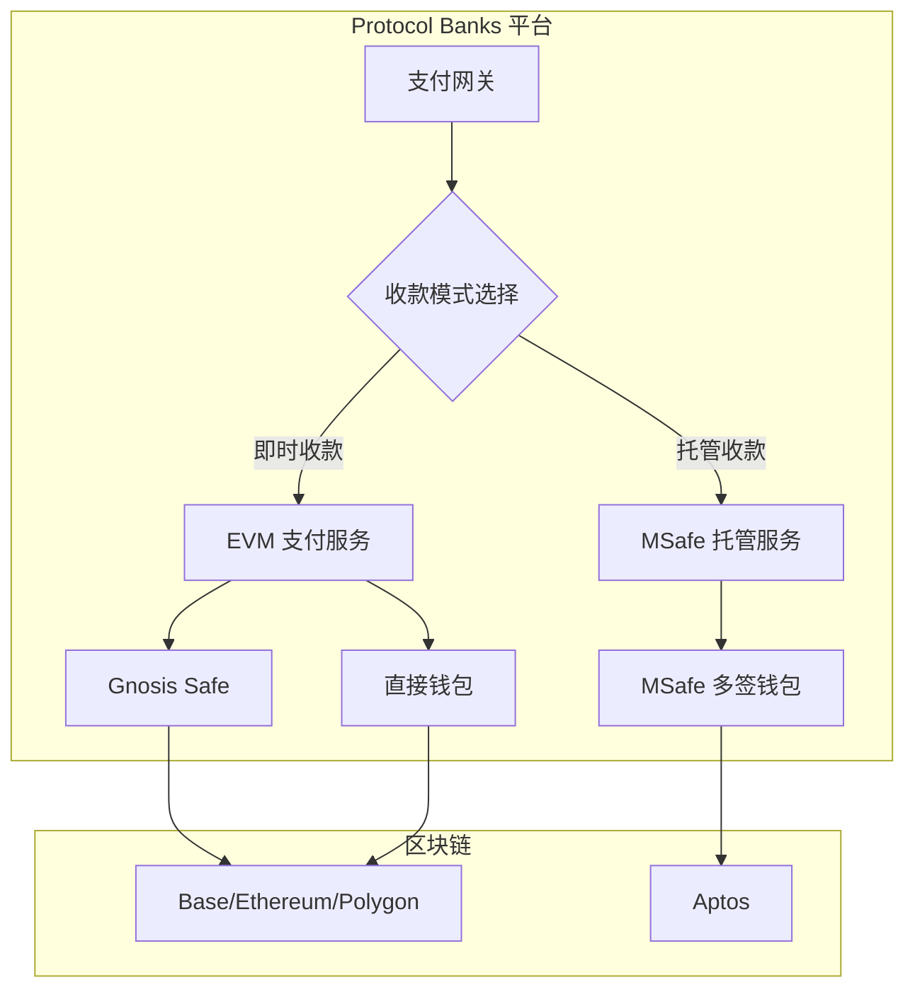
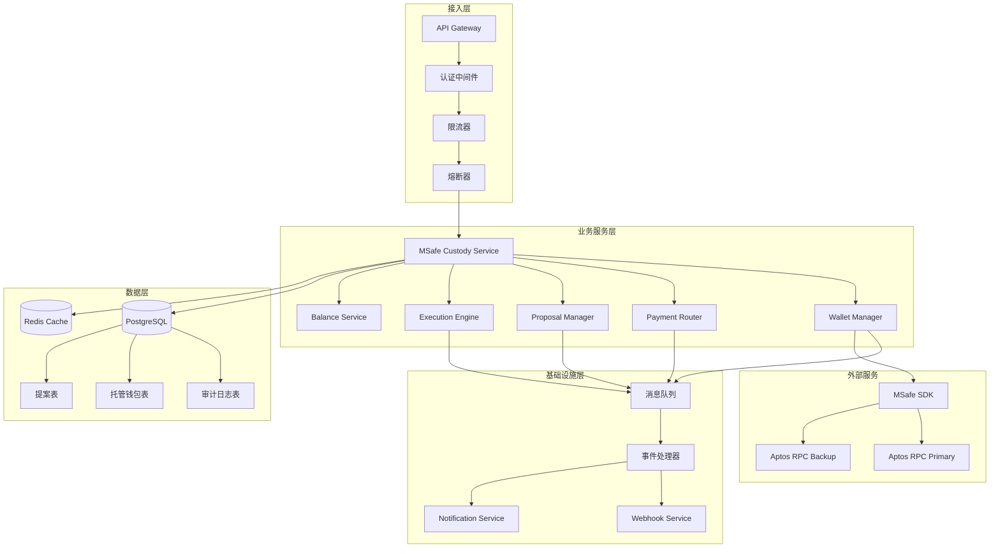
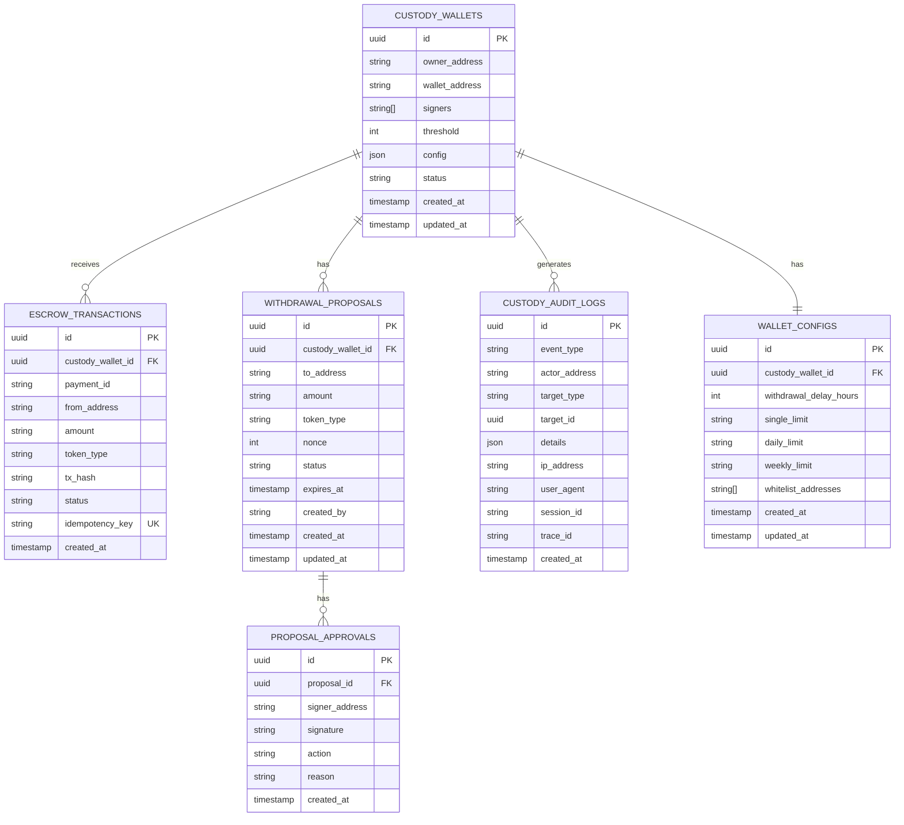

# 设计文档

## 概述

本设计文档描述 MSafe 多签托管集成的技术实现方案。该功能作为 Protocol Banks 的可选增值服务，为商户提供基于 Aptos 区块链的稳定币托管收单能力，与现有 EVM 支付系统并行运行。

### 与现有系统的关系



## 架构

### 系统架构图



### 服务分层

| 层级 | 组件 | 职责 |
|------|------|------|
| 接入层 | API Gateway | 请求路由、认证、限流 |
| 业务层 | MSafe Custody Service | 核心业务逻辑编排 |
| 基础设施层 | 消息队列、缓存 | 异步处理、性能优化 |
| 数据层 | PostgreSQL、Redis | 数据持久化、缓存 |
| 外部服务 | MSafe SDK | 区块链交互 |

## 组件和接口

### 核心服务接口

```typescript
// MSafe 托管服务主接口
interface IMSafeCustodyService {
  // 钱包管理
  createCustodyWallet(input: CreateWalletInput): Promise<CustodyWallet>;
  getCustodyWallet(walletId: string): Promise<CustodyWallet | null>;
  updateWalletConfig(walletId: string, config: WalletConfig): Promise<void>;
  
  // 支付路由
  routePayment(payment: PaymentRequest): Promise<RoutingResult>;
  getEscrowTransactions(walletId: string, options: QueryOptions): Promise<EscrowTransaction[]>;
  
  // 余额查询
  getBalance(walletId: string): Promise<BalanceInfo>;
  
  // 提款管理
  createWithdrawalProposal(input: CreateProposalInput): Promise<WithdrawalProposal>;
  approveProposal(proposalId: string, approval: ApprovalInput): Promise<void>;
  rejectProposal(proposalId: string, rejection: RejectionInput): Promise<void>;
  executeProposal(proposalId: string): Promise<ExecutionResult>;
}

// 钱包管理器接口
interface IWalletManager {
  create(signers: string[], threshold: number, ownerAddress: string): Promise<CustodyWallet>;
  addSigner(walletId: string, signer: string): Promise<void>;
  removeSigner(walletId: string, signer: string): Promise<void>;
  updateThreshold(walletId: string, threshold: number): Promise<void>;
}

// 支付路由器接口
interface IPaymentRouter {
  route(payment: PaymentRequest): Promise<RoutingResult>;
  checkIdempotency(idempotencyKey: string): Promise<CachedResult | null>;
  recordEscrow(escrow: EscrowTransaction): Promise<void>;
}

// 提案管理器接口
interface IProposalManager {
  create(input: CreateProposalInput): Promise<WithdrawalProposal>;
  approve(proposalId: string, signerAddress: string, signature: string): Promise<void>;
  reject(proposalId: string, signerAddress: string, reason: string): Promise<void>;
  getStatus(proposalId: string): Promise<ProposalStatus>;
}

// 执行引擎接口
interface IExecutionEngine {
  execute(proposalId: string): Promise<ExecutionResult>;
  checkDelay(proposalId: string): Promise<boolean>;
  assembleSignatures(proposalId: string): Promise<MultiEd25519Signature>;
  submitTransaction(proposal: WithdrawalProposal, signature: MultiEd25519Signature): Promise<string>;
}
```

### MSafe SDK 适配器

```typescript
// MSafe SDK 适配器 - 封装与 MSafe 的交互
interface IMSafeAdapter {
  // 钱包操作
  createMultisigWallet(signers: string[], threshold: number): Promise<MSafeWalletInfo>;
  getWalletInfo(address: string): Promise<MSafeWalletInfo>;
  
  // 余额查询
  getTokenBalance(walletAddress: string, tokenType: string): Promise<bigint>;
  
  // 交易操作
  createTransaction(payload: TransactionPayload): Promise<PendingTransaction>;
  signTransaction(txId: string, signature: string): Promise<void>;
  executeTransaction(txId: string): Promise<string>;
  getTransactionStatus(txHash: string): Promise<TransactionStatus>;
  
  // 签名验证
  verifySignature(message: string, signature: string, publicKey: string): boolean;
}

// RPC 故障转移管理
interface IRpcManager {
  getPrimaryRpc(): string;
  getBackupRpc(): string;
  switchToBackup(): void;
  healthCheck(): Promise<boolean>;
}
```

## 数据模型

### 数据库表结构



### 核心数据类型

```typescript
// 托管钱包
interface CustodyWallet {
  id: string;
  ownerAddress: string;
  walletAddress: string;
  signers: string[];
  threshold: number;
  config: WalletConfig;
  status: 'active' | 'suspended' | 'closed';
  createdAt: Date;
  updatedAt: Date;
}

// 钱包配置
interface WalletConfig {
  withdrawalDelayHours: number;
  singleLimit: string;
  dailyLimit: string;
  weeklyLimit: string;
  whitelistAddresses: string[];
}

// 托管交易
interface EscrowTransaction {
  id: string;
  custodyWalletId: string;
  paymentId: string;
  fromAddress: string;
  amount: string;
  tokenType: string;
  txHash: string;
  status: 'pending' | 'confirmed' | 'failed';
  idempotencyKey: string;
  createdAt: Date;
}

// 提款提案
interface WithdrawalProposal {
  id: string;
  custodyWalletId: string;
  toAddress: string;
  amount: string;
  tokenType: string;
  nonce: number;
  status: ProposalStatus;
  expiresAt: Date;
  createdBy: string;
  approvals: ProposalApproval[];
  createdAt: Date;
  updatedAt: Date;
}

type ProposalStatus = 
  | 'pending'      // 待审批
  | 'ready'        // 待执行
  | 'executing'    // 执行中
  | 'completed'    // 已完成
  | 'rejected'     // 已拒绝
  | 'expired'      // 已过期
  | 'failed';      // 失败

// 提案审批
interface ProposalApproval {
  id: string;
  proposalId: string;
  signerAddress: string;
  signature: string;
  action: 'approve' | 'reject';
  reason?: string;
  createdAt: Date;
}

// 余额信息
interface BalanceInfo {
  walletAddress: string;
  balances: TokenBalance[];
  pendingIncoming: string;
  isStale: boolean;
  lastUpdated: Date;
}

interface TokenBalance {
  tokenType: string;
  amount: string;
  amountUsd: string;
}
```

## 正确性属性

*正确性属性是系统在所有有效执行中都应保持为真的特征或行为。属性作为人类可读规范和机器可验证正确性保证之间的桥梁。*

### Property 1: 钱包创建参数验证
*For any* 钱包创建请求，如果签名者数量小于 2 或阈值小于 2，系统应拒绝创建并返回验证错误
**Validates: Requirements 1.2**

### Property 2: 唯一标识符生成
*For any* 创建的托管钱包或提款提案，其 ID 和 nonce 值在整个系统中应是唯一的
**Validates: Requirements 1.5, 4.6**

### Property 3: 幂等性保证
*For any* 具有相同幂等键的支付请求或相同签名者对同一提案的重复操作，系统应只处理一次并返回相同结果
**Validates: Requirements 2.1, 5.6**

### Property 4: 支付路由正确性
*For any* 配置了托管钱包的商户收到的支付，支付应被路由到对应的 MSafe 托管地址而非商户直接钱包
**Validates: Requirements 2.2**

### Property 5: 托管交易数据完整性
*For any* 成功路由到托管的支付，系统记录的托管交易应包含支付 ID、金额、代币类型、时间戳和幂等键
**Validates: Requirements 2.3**

### Property 6: 指数退避重试
*For any* 失败的支付路由或交易提交，系统应使用指数退避策略重试，最多尝试指定次数
**Validates: Requirements 2.4, 6.5**

### Property 7: RPC 故障转移
*For any* 主 RPC 连接失败的情况，系统应自动切换到备用 RPC 端点继续服务
**Validates: Requirements 2.6, 9.1**

### Property 8: 缓存行为正确性
*For any* 余额查询请求，如果缓存有效则返回缓存数据，如果缓存过期或查询失败则返回过期数据并标记
**Validates: Requirements 3.1, 3.4, 3.5**

### Property 9: 签名者授权验证
*For any* 提款提案创建或审批请求，系统应验证请求者是托管钱包的授权签名者
**Validates: Requirements 4.1, 5.1**

### Property 10: 余额验证
*For any* 提款提案，提款金额不应超过托管钱包的可用余额
**Validates: Requirements 4.3**

### Property 11: 提案状态转换
*For any* 提款提案，当批准数达到阈值时状态应更新为"待执行"，当拒绝数超过 (总签名者数 - 阈值) 时状态应更新为"已拒绝"
**Validates: Requirements 5.3, 5.5**

### Property 12: 提款延迟执行
*For any* 达到"待执行"状态的提案，系统应在配置的延迟期过后才执行交易
**Validates: Requirements 6.1**

### Property 13: 审计日志完整性
*For any* 托管钱包创建、托管交易、提案操作，系统应记录包含完整元数据的审计日志
**Validates: Requirements 7.1, 7.2, 7.3, 7.4**

### Property 14: 审计日志不可变性
*For any* 已创建的审计日志记录，系统应拒绝任何更新或删除操作
**Validates: Requirements 7.5**

### Property 15: 提款限额验证
*For any* 提款请求，如果金额超过配置的单笔、每日或每周限额，系统应要求额外审批
**Validates: Requirements 8.2, 8.3**

### Property 16: 熔断器状态转换
*For any* 服务调用，当失败率超过阈值时熔断器应打开，在冷却期后进入半开状态
**Validates: Requirements 9.4**

### Property 17: 数据序列化往返
*For any* 有效的托管钱包对象，序列化然后反序列化应产生等价对象
**Validates: Requirements 10.3**

### Property 18: Schema 验证
*For any* 存储操作，数据应通过 JSON Schema 验证，无效数据应被拒绝并返回具体错误
**Validates: Requirements 10.4, 10.5**

## 错误处理

### 错误分类

| 错误类型 | HTTP 状态码 | 处理策略 |
|----------|-------------|----------|
| 验证错误 | 400 | 返回具体字段错误 |
| 认证错误 | 401 | 返回认证失败信息 |
| 授权错误 | 403 | 返回权限不足信息 |
| 资源不存在 | 404 | 返回资源未找到 |
| 幂等冲突 | 409 | 返回已处理结果 |
| 限流 | 429 | 返回重试时间 |
| 服务不可用 | 503 | 触发熔断，返回降级响应 |

### 错误响应格式

```typescript
interface ErrorResponse {
  error: {
    code: string;
    message: string;
    details?: Record<string, string[]>;
    traceId: string;
  };
}

// 示例
{
  "error": {
    "code": "VALIDATION_ERROR",
    "message": "Invalid withdrawal proposal",
    "details": {
      "amount": ["Amount exceeds available balance"],
      "toAddress": ["Address not in whitelist"]
    },
    "traceId": "abc123"
  }
}
```

### 重试策略

```typescript
interface RetryConfig {
  maxAttempts: number;
  initialDelayMs: number;
  maxDelayMs: number;
  backoffMultiplier: number;
}

const defaultRetryConfig: RetryConfig = {
  maxAttempts: 5,
  initialDelayMs: 1000,
  maxDelayMs: 30000,
  backoffMultiplier: 2,
};

// 计算延迟: delay = min(initialDelay * (multiplier ^ attempt), maxDelay)
```

## 测试策略

### 测试类型

| 类型 | 覆盖范围 | 工具 |
|------|----------|------|
| 单元测试 | 业务逻辑、工具函数 | Jest |
| 属性测试 | 正确性属性验证 | fast-check |
| 集成测试 | 服务间交互 | Jest + Supertest |
| E2E 测试 | 完整流程 | Playwright |

### 属性测试配置

```typescript
// 属性测试配置
const propertyTestConfig = {
  numRuns: 100,  // 每个属性至少运行 100 次
  seed: Date.now(),
  verbose: true,
};
```

### 测试数据生成器

```typescript
import * as fc from 'fast-check';

// 钱包创建输入生成器
const walletInputArb = fc.record({
  signers: fc.array(fc.hexaString({ minLength: 64, maxLength: 64 }), { minLength: 2, maxLength: 10 }),
  threshold: fc.integer({ min: 2, max: 10 }),
  ownerAddress: fc.hexaString({ minLength: 64, maxLength: 64 }),
});

// 提款提案输入生成器
const proposalInputArb = fc.record({
  toAddress: fc.hexaString({ minLength: 64, maxLength: 64 }),
  amount: fc.bigInt({ min: 1n, max: 1000000000000n }).map(String),
  tokenType: fc.constantFrom('USDC', 'USDT', 'DAI'),
});
```

### 关键测试场景

1. **钱包创建验证** - 验证签名者和阈值约束
2. **幂等性测试** - 验证重复请求返回相同结果
3. **状态转换测试** - 验证提案状态机正确性
4. **故障转移测试** - 验证 RPC 切换行为
5. **序列化往返测试** - 验证数据完整性
