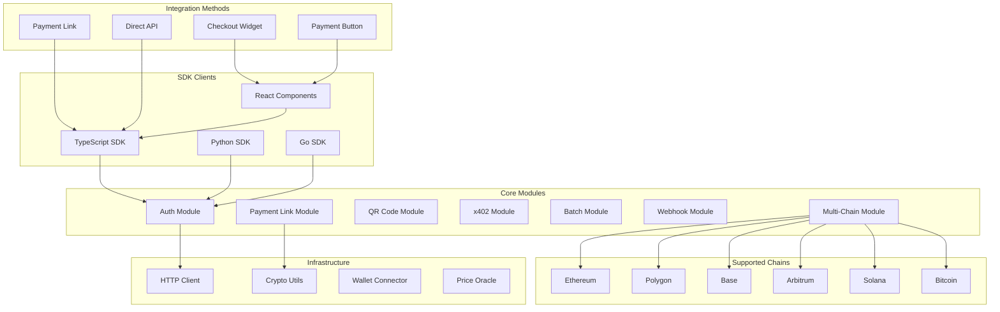
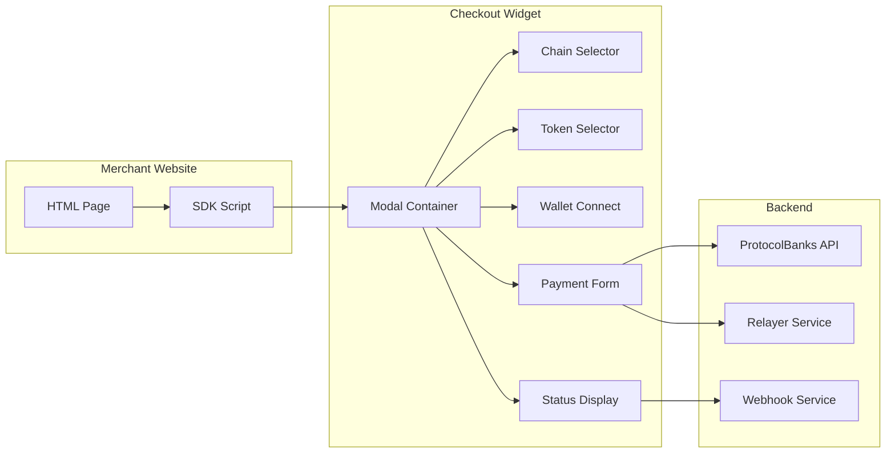
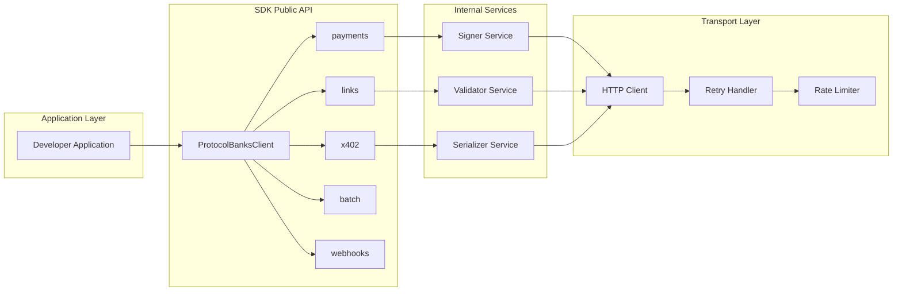
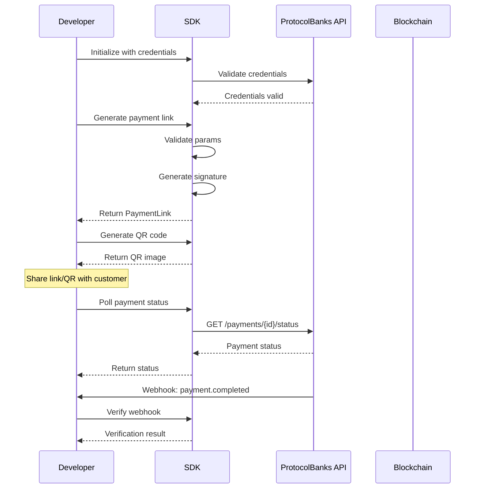

# Design Document: ProtocolBanks Payment SDK

## Overview

ProtocolBanks Payment SDK 是一套多语言软件开发工具包，为开发者提供简单、安全的方式集成加密货币支付收单功能。SDK 支持多种加密货币（USDC、USDT、DAI、ETH、BTC、SOL）、多条区块链（Ethereum、Polygon、Base、Arbitrum、Solana、Bitcoin），提供易于部署的嵌入式收款组件，让商户可以在几分钟内在自己的网站上开始收取加密货币。

### 核心设计原则

1. **一致性**: 所有语言实现保持相同的 API 设计和行为
2. **安全性**: 内置签名验证、防篡改检测、敏感数据保护
3. **易用性**: 简洁的 API、完整的类型定义、丰富的示例
4. **可靠性**: 自动重试、错误恢复、状态追踪
5. **快速部署**: 一行代码即可嵌入收款组件

## Architecture



### 嵌入式组件架构



### SDK 架构层次



## Components and Interfaces

### 0. 支持的链和代币

```typescript
// Supported Chains
type ChainId = 1 | 137 | 8453 | 42161 | 10 | 56 | 'solana' | 'bitcoin';

interface ChainConfig {
  id: ChainId;
  name: string;
  nativeCurrency: string;
  rpcUrl: string;
  explorerUrl: string;
  tokens: TokenConfig[];
}

interface TokenConfig {
  symbol: string;
  name: string;
  address: string;      // Contract address (or 'native' for native tokens)
  decimals: number;
  supportsGasless: boolean;  // x402 support
}

// Supported tokens per chain
const SUPPORTED_TOKENS = {
  1: ['USDC', 'USDT', 'DAI', 'ETH'],           // Ethereum
  137: ['USDC', 'USDT', 'DAI', 'MATIC'],       // Polygon
  8453: ['USDC', 'USDT', 'ETH'],               // Base
  42161: ['USDC', 'USDT', 'DAI', 'ETH'],       // Arbitrum
  10: ['USDC', 'USDT', 'DAI', 'ETH'],          // Optimism
  56: ['USDC', 'USDT', 'DAI', 'BNB'],          // BSC
  'solana': ['SOL', 'USDC'],                   // Solana
  'bitcoin': ['BTC'],                          // Bitcoin
};
```

### 1. SDK Client (主入口)

```typescript
// TypeScript Interface
interface ProtocolBanksConfig {
  apiKey: string;
  apiSecret: string;
  environment: 'production' | 'sandbox' | 'testnet';
  baseUrl?: string;
  timeout?: number;
  retryConfig?: RetryConfig;
  logger?: Logger;
  defaultChain?: ChainId;
  supportedChains?: ChainId[];
  supportedTokens?: string[];
}

interface RetryConfig {
  maxRetries: number;
  initialDelay: number;
  maxDelay: number;
  backoffMultiplier: number;
}

class ProtocolBanksClient {
  constructor(config: ProtocolBanksConfig);
  
  // Sub-modules
  readonly links: PaymentLinkModule;
  readonly payments: PaymentModule;
  readonly x402: X402Module;
  readonly batch: BatchModule;
  readonly webhooks: WebhookModule;
  readonly checkout: CheckoutModule;  // NEW: Embedded checkout
  
  // Lifecycle
  async initialize(): Promise<void>;
  async close(): Promise<void>;
}
```

### 2. Payment Link Module (支付链接模块)

```typescript
interface PaymentLinkParams {
  to: string;           // Recipient address (0x... or Solana/Bitcoin address)
  amount: string;       // Amount in token units
  token?: string;       // Token symbol (default: USDC)
  chain?: ChainId;      // Specific chain (optional, allows multi-chain)
  expiryHours?: number; // Expiry time (default: 24)
  memo?: string;        // Optional reference
  orderId?: string;     // Merchant order ID
  callbackUrl?: string; // Redirect URL after payment
  allowedChains?: ChainId[];  // Allowed chains for payer to choose
  allowedTokens?: string[];   // Allowed tokens for payer to choose
}

interface PaymentLink {
  url: string;
  shortUrl: string;     // Short URL for sharing
  params: PaymentLinkParams;
  signature: string;
  expiresAt: Date;
  createdAt: Date;
  paymentId: string;    // Unique payment ID for tracking
}

interface LinkVerificationResult {
  valid: boolean;
  expired: boolean;
  tamperedFields: string[];
  params?: PaymentLinkParams;
  error?: string;
}

interface PaymentLinkModule {
  // Generate signed payment link
  generate(params: PaymentLinkParams): PaymentLink;
  
  // Verify payment link integrity
  verify(url: string): LinkVerificationResult;
  
  // Parse payment link parameters
  parse(url: string): PaymentLinkParams | null;
  
  // Generate QR code from payment link
  generateQR(link: PaymentLink, options?: QROptions): Promise<QRCode>;
  
  // Get supported chains for a token
  getSupportedChains(token: string): ChainId[];
  
  // Get supported tokens for a chain
  getSupportedTokens(chain: ChainId): string[];
}
```

### 3. QR Code Module (二维码模块)

```typescript
interface QROptions {
  size?: number;        // Size in pixels (100-1000)
  format?: 'svg' | 'png' | 'base64';
  errorCorrection?: 'L' | 'M' | 'Q' | 'H';
  logo?: string;        // Logo URL or base64
  logoSize?: number;    // Logo size ratio (0.1-0.3)
  foreground?: string;  // Foreground color
  background?: string;  // Background color
}

interface QRCode {
  data: string;         // SVG string, PNG buffer, or base64
  format: string;
  size: number;
  paymentLink: string;
}
```

### 4. Checkout Module (嵌入式收款组件) - NEW

```typescript
interface CheckoutConfig {
  amount: string;
  currency?: string;        // Fiat currency for display (USD, EUR, CNY)
  token?: string;           // Preferred token
  chain?: ChainId;          // Preferred chain
  allowedChains?: ChainId[];
  allowedTokens?: string[];
  recipientAddress: string;
  orderId?: string;
  memo?: string;
  callbackUrl?: string;
  webhookUrl?: string;
  theme?: CheckoutTheme;
  locale?: 'en' | 'zh' | 'es' | 'ja';
}

interface CheckoutTheme {
  primaryColor?: string;
  backgroundColor?: string;
  textColor?: string;
  borderRadius?: string;
  fontFamily?: string;
  logo?: string;
  companyName?: string;
}

interface CheckoutResult {
  success: boolean;
  paymentId: string;
  transactionHash?: string;
  chain: ChainId;
  token: string;
  amount: string;
  error?: string;
}

interface CheckoutModule {
  // Open checkout modal
  open(config: CheckoutConfig): Promise<CheckoutResult>;
  
  // Close checkout modal
  close(): void;
  
  // Create checkout session (for server-side)
  createSession(config: CheckoutConfig): Promise<{ sessionId: string; url: string }>;
  
  // Get session status
  getSessionStatus(sessionId: string): Promise<CheckoutResult>;
  
  // Generate embed code
  getEmbedCode(config: CheckoutConfig): string;
}

// React Component
interface PaymentButtonProps {
  amount: string;
  token?: string;
  recipientAddress: string;
  orderId?: string;
  onSuccess?: (result: CheckoutResult) => void;
  onError?: (error: Error) => void;
  onCancel?: () => void;
  style?: 'default' | 'minimal' | 'branded';
  size?: 'small' | 'medium' | 'large';
  label?: string;
  disabled?: boolean;
}

// Usage: <PaymentButton amount="100" token="USDC" recipientAddress="0x..." />
```

### 5. 快速集成代码示例

```html
<!-- 最简单的集成方式：一行代码 -->
<script src="https://sdk.protocolbanks.com/checkout.js"></script>
<div 
  id="pb-checkout" 
  data-api-key="pk_live_xxx"
  data-amount="100"
  data-token="USDC"
  data-recipient="0x1234..."
></div>

<!-- 或者使用 Payment Button -->
<button 
  class="pb-pay-button"
  data-amount="50"
  data-token="USDC"
  data-recipient="0x1234..."
>
  Pay with Crypto
</button>
```

```typescript
// React 集成
import { PaymentButton, CheckoutProvider } from '@protocolbanks/react';

function App() {
  return (
    <CheckoutProvider apiKey="pk_live_xxx">
      <PaymentButton
        amount="100"
        token="USDC"
        recipientAddress="0x1234..."
        onSuccess={(result) => console.log('Paid!', result)}
      />
    </CheckoutProvider>
  );
}
```

### 6. x402 Module (Gasless 支付模块)

```typescript
interface X402AuthorizationParams {
  to: string;
  amount: string;
  token: string;
  chainId: number;
  validFor?: number;    // Seconds (default: 3600)
}

interface X402Authorization {
  id: string;
  domain: EIP712Domain;
  types: EIP712Types;
  message: TransferWithAuthorizationMessage;
  status: 'pending' | 'signed' | 'submitted' | 'executed' | 'failed' | 'expired';
  transactionHash?: string;
  createdAt: Date;
  expiresAt: Date;
}

interface EIP712Domain {
  name: string;
  version: string;
  chainId: number;
  verifyingContract: string;
}

interface TransferWithAuthorizationMessage {
  from: string;
  to: string;
  value: string;
  validAfter: number;
  validBefore: number;
  nonce: string;
}

interface X402Module {
  // Generate EIP-712 authorization for signing
  createAuthorization(params: X402AuthorizationParams): Promise<X402Authorization>;
  
  // Submit signed authorization to relayer
  submitSignature(authId: string, signature: string): Promise<X402Authorization>;
  
  // Get authorization status
  getStatus(authId: string): Promise<X402Authorization>;
  
  // Cancel pending authorization
  cancel(authId: string): Promise<void>;
  
  // Check if chain supports x402
  isChainSupported(chainId: number): boolean;
}
```

### 7. Batch Module (批量支付模块)

```typescript
interface BatchRecipient {
  address: string;
  amount: string;
  token: string;
  memo?: string;
}

interface BatchValidationError {
  index: number;
  address: string;
  errors: string[];
}

interface BatchSubmitResult {
  batchId: string;
  status: 'pending' | 'processing' | 'completed' | 'failed';
  validCount: number;
  invalidCount: number;
  errors: BatchValidationError[];
}

interface BatchStatus {
  batchId: string;
  status: string;
  progress: {
    total: number;
    completed: number;
    failed: number;
    pending: number;
  };
  items: BatchItemStatus[];
}

interface BatchModule {
  // Validate batch recipients
  validate(recipients: BatchRecipient[]): Promise<BatchValidationError[]>;
  
  // Submit batch payment
  submit(recipients: BatchRecipient[], options?: BatchOptions): Promise<BatchSubmitResult>;
  
  // Get batch status
  getStatus(batchId: string): Promise<BatchStatus>;
  
  // Retry failed items
  retry(batchId: string, itemIndices?: number[]): Promise<BatchSubmitResult>;
  
  // Poll status with callback
  poll(batchId: string, callback: (status: BatchStatus) => void, interval?: number): () => void;
}
```

### 8. Webhook Module (Webhook 模块)

```typescript
interface WebhookEvent {
  id: string;
  type: 'payment.completed' | 'payment.failed' | 'payment.expired' | 
        'batch.completed' | 'batch.failed' | 'x402.executed';
  timestamp: Date;
  data: Record<string, any>;
}

interface WebhookVerificationResult {
  valid: boolean;
  event?: WebhookEvent;
  error?: string;
}

interface WebhookModule {
  // Verify webhook signature
  verify(payload: string, signature: string, secret: string): WebhookVerificationResult;
  
  // Parse webhook event
  parse(payload: string): WebhookEvent;
  
  // Generate webhook signature (for testing)
  sign(payload: string, secret: string): string;
}
```

## Data Models

### Payment Link URL Format

```
https://app.protocolbanks.com/pay?to={address}&amount={amount}&token={token}&exp={expiry}&memo={memo}&sig={signature}
```

| Parameter | Type | Required | Description |
|-----------|------|----------|-------------|
| to | string | Yes | Recipient address (0x + 40 hex) |
| amount | string | Yes | Payment amount |
| token | string | No | Token symbol (default: USDC) |
| exp | number | Yes | Expiry timestamp (ms) |
| memo | string | No | Payment reference |
| sig | string | Yes | HMAC-SHA256 signature (16 chars) |

### Signature Generation

```typescript
// Signature algorithm
function generateSignature(params: PaymentLinkParams, secret: string): string {
  const normalized = {
    to: params.to.toLowerCase(),
    amount: params.amount,
    token: (params.token || 'USDC').toUpperCase(),
    expiry: params.expiryTimestamp.toString(),
    memo: params.memo || ''
  };
  
  const dataToSign = Object.entries(normalized)
    .sort(([a], [b]) => a.localeCompare(b))
    .map(([k, v]) => `${k}=${v}`)
    .join('&');
  
  const hmac = crypto.createHmac('sha256', secret);
  hmac.update(dataToSign);
  return hmac.digest('hex').substring(0, 16);
}
```

### Error Response Format

```typescript
interface SDKError {
  code: string;           // e.g., "PB_AUTH_001"
  message: string;        // Human-readable message
  details?: any;          // Additional context
  retryable: boolean;     // Whether retry is recommended
  retryAfter?: number;    // Seconds to wait before retry
}

// Error code categories
// PB_AUTH_xxx    - Authentication errors
// PB_LINK_xxx    - Payment link errors
// PB_X402_xxx    - x402 protocol errors
// PB_BATCH_xxx   - Batch payment errors
// PB_NET_xxx     - Network errors
// PB_RATE_xxx    - Rate limit errors
```

## Correctness Properties

*A property is a characteristic or behavior that should hold true across all valid executions of a system—essentially, a formal statement about what the system should do. Properties serve as the bridge between human-readable specifications and machine-verifiable correctness guarantees.*

### Property 1: Payment Link Round-Trip Verification

*For any* valid payment link parameters, generating a payment link and then verifying it SHALL return valid=true with the original parameters intact.

**Validates: Requirements 2.1, 2.5, 4.1, 4.5**

### Property 2: Payment Link Parameter Validation

*For any* recipient address not matching the pattern `0x[a-fA-F0-9]{40}`, the SDK SHALL reject the payment link generation with a validation error.

**Validates: Requirements 2.2**

### Property 3: Amount Validation Bounds

*For any* amount value, the SDK SHALL accept only positive numbers up to 1 billion, rejecting all other values with appropriate errors.

**Validates: Requirements 2.3**

### Property 4: Expiry Time Calculation

*For any* expiry hours value between 1 and 168 (7 days), the generated payment link expiry timestamp SHALL be within 1 second of the expected value.

**Validates: Requirements 2.4**

### Property 5: Tamper Detection

*For any* valid payment link, modifying any parameter (to, amount, token, expiry) SHALL cause verification to fail with the modified field identified in tamperedFields.

**Validates: Requirements 4.3**

### Property 6: Homoglyph Attack Detection

*For any* address containing Cyrillic characters that visually resemble Latin characters (а, е, о, р, с, х), the SDK SHALL detect and report the homoglyph attack.

**Validates: Requirements 4.4**

### Property 7: Expired Link Detection

*For any* payment link with expiry timestamp in the past, verification SHALL return expired=true.

**Validates: Requirements 4.2**

### Property 8: x402 Authorization Lifecycle

*For any* x402 authorization, the status SHALL transition only through valid states: pending → signed → submitted → (executed | failed | expired).

**Validates: Requirements 7.4**

### Property 9: x402 Nonce Uniqueness

*For any* two x402 authorizations created for the same user, the nonces SHALL be different.

**Validates: Requirements 7.6**

### Property 10: x402 Expiry Enforcement

*For any* x402 authorization older than 1 hour, attempting to submit SHALL return an expiry error.

**Validates: Requirements 7.5**

### Property 11: Batch Validation Completeness

*For any* batch of recipients, validation SHALL check every recipient and return errors for all invalid entries, not just the first.

**Validates: Requirements 8.2, 8.5**

### Property 12: Batch Size Limit

*For any* batch with more than 500 recipients, the SDK SHALL reject with a size limit error.

**Validates: Requirements 8.6**

### Property 13: Error Code Format Consistency

*For any* error returned by the SDK, the error code SHALL match the pattern `PB_[A-Z]+_[0-9]{3}`.

**Validates: Requirements 9.1**

### Property 14: Webhook Signature Verification

*For any* webhook payload and secret, signing the payload and then verifying with the same secret SHALL return valid=true.

**Validates: Requirements 6.2**

### Property 15: Sensitive Data Protection

*For any* log output from the SDK, the output SHALL NOT contain API keys, secrets, signatures, or private keys.

**Validates: Requirements 11.1**

### Property 16: HTTPS Enforcement

*For any* API request made by the SDK, the URL SHALL use the HTTPS protocol.

**Validates: Requirements 11.2**

### Property 17: API Consistency Across Languages

*For any* public method in the TypeScript SDK, an equivalent method with the same parameters and return type SHALL exist in Python and Go SDKs.

**Validates: Requirements 10.5**

## Error Handling

### Error Categories

| Category | Code Range | Description | Retry Strategy |
|----------|------------|-------------|----------------|
| Authentication | PB_AUTH_001-099 | API key/token errors | Refresh token, then retry |
| Validation | PB_LINK_001-099 | Input validation errors | Fix input, no retry |
| x402 | PB_X402_001-099 | Gasless payment errors | Depends on error |
| Batch | PB_BATCH_001-099 | Batch processing errors | Retry failed items |
| Network | PB_NET_001-099 | Connection errors | Exponential backoff |
| Rate Limit | PB_RATE_001-099 | Rate limit exceeded | Wait retry-after |

### Retry Strategy

```typescript
interface RetryStrategy {
  shouldRetry(error: SDKError, attempt: number): boolean;
  getDelay(attempt: number): number;
}

const defaultRetryStrategy: RetryStrategy = {
  shouldRetry: (error, attempt) => {
    if (attempt >= 3) return false;
    if (error.code.startsWith('PB_NET_')) return true;
    if (error.code.startsWith('PB_RATE_')) return true;
    return error.retryable;
  },
  getDelay: (attempt) => Math.min(1000 * Math.pow(2, attempt), 30000)
};
```

## Testing Strategy

### Unit Tests

- Test each module in isolation with mocked dependencies
- Test input validation for all parameters
- Test error handling for all error codes
- Test edge cases (empty inputs, max values, special characters)

### Property-Based Tests

Using fast-check (TypeScript), Hypothesis (Python), or rapid (Go):

1. **Payment Link Round-Trip**: Generate random valid parameters, create link, verify
2. **Tamper Detection**: Generate valid link, randomly modify, verify detection
3. **Homoglyph Detection**: Generate addresses with random homoglyph substitutions
4. **Batch Validation**: Generate random batches with mix of valid/invalid recipients
5. **Error Code Format**: Generate errors, verify code format

### Integration Tests

- Test against sandbox environment
- Test full payment flow end-to-end
- Test webhook delivery and verification
- Test x402 authorization flow

### Test Configuration

```typescript
// Property test configuration
const propertyTestConfig = {
  numRuns: 100,           // Minimum 100 iterations
  seed: Date.now(),       // Reproducible with seed
  verbose: true,          // Log counterexamples
  timeout: 30000          // 30 second timeout
};
```

## SDK Package Structure

### TypeScript SDK

```
@protocolbanks/sdk/
├── src/
│   ├── index.ts              # Main exports
│   ├── client.ts             # ProtocolBanksClient
│   ├── modules/
│   │   ├── links.ts          # PaymentLinkModule
│   │   ├── payments.ts       # PaymentModule
│   │   ├── x402.ts           # X402Module
│   │   ├── batch.ts          # BatchModule
│   │   └── webhooks.ts       # WebhookModule
│   ├── utils/
│   │   ├── crypto.ts         # Signature utilities
│   │   ├── validation.ts     # Input validation
│   │   └── errors.ts         # Error handling
│   └── types/
│       └── index.ts          # Type definitions
├── tests/
│   ├── unit/
│   ├── property/
│   └── integration/
├── package.json
├── tsconfig.json
└── README.md
```

### Python SDK

```
protocolbanks/
├── protocolbanks/
│   ├── __init__.py
│   ├── client.py
│   ├── modules/
│   │   ├── links.py
│   │   ├── payments.py
│   │   ├── x402.py
│   │   ├── batch.py
│   │   └── webhooks.py
│   ├── utils/
│   │   ├── crypto.py
│   │   ├── validation.py
│   │   └── errors.py
│   └── types.py
├── tests/
├── setup.py
├── pyproject.toml
└── README.md
```

### Go SDK

```
protocolbanks-go/
├── client.go
├── links.go
├── payments.go
├── x402.go
├── batch.go
├── webhooks.go
├── crypto/
│   └── signature.go
├── validation/
│   └── validator.go
├── errors/
│   └── errors.go
├── types.go
├── client_test.go
├── go.mod
└── README.md
```

## Usage Examples

### TypeScript Quick Start

```typescript
import { ProtocolBanksClient } from '@protocolbanks/sdk';

// Initialize client
const client = new ProtocolBanksClient({
  apiKey: 'pk_live_xxx',
  apiSecret: 'sk_live_xxx',
  environment: 'production'
});

// Generate payment link
const link = client.links.generate({
  to: '0x1234567890123456789012345678901234567890',
  amount: '100',
  token: 'USDC',
  expiryHours: 24,
  memo: 'Invoice #12345'
});

console.log('Payment URL:', link.url);

// Generate QR code
const qr = await client.links.generateQR(link, {
  size: 300,
  format: 'svg'
});

// Verify payment link
const verification = client.links.verify(link.url);
if (verification.valid) {
  console.log('Link is valid, params:', verification.params);
}
```

### Python Quick Start

```python
from protocolbanks import ProtocolBanksClient

# Initialize client
client = ProtocolBanksClient(
    api_key='pk_live_xxx',
    api_secret='sk_live_xxx',
    environment='production'
)

# Generate payment link
link = client.links.generate(
    to='0x1234567890123456789012345678901234567890',
    amount='100',
    token='USDC',
    expiry_hours=24,
    memo='Invoice #12345'
)

print(f'Payment URL: {link.url}')

# Verify webhook
result = client.webhooks.verify(
    payload=request.body,
    signature=request.headers['X-PB-Signature'],
    secret='whsec_xxx'
)

if result.valid:
    event = result.event
    if event.type == 'payment.completed':
        print(f'Payment completed: {event.data}')
```

### Go Quick Start

```go
package main

import (
    "fmt"
    pb "github.com/protocolbanks/protocolbanks-go"
)

func main() {
    // Initialize client
    client := pb.NewClient(&pb.Config{
        APIKey:      "pk_live_xxx",
        APISecret:   "sk_live_xxx",
        Environment: pb.Production,
    })

    // Generate payment link
    link, err := client.Links.Generate(&pb.PaymentLinkParams{
        To:          "0x1234567890123456789012345678901234567890",
        Amount:      "100",
        Token:       "USDC",
        ExpiryHours: 24,
        Memo:        "Invoice #12345",
    })
    if err != nil {
        panic(err)
    }

    fmt.Printf("Payment URL: %s\n", link.URL)
}
```

## Deployment Flow



