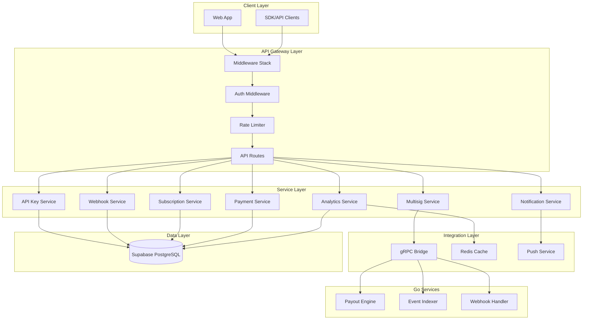
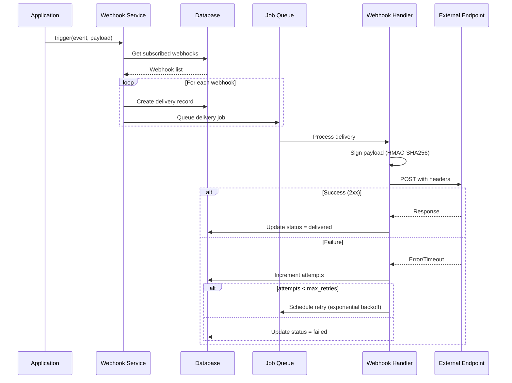

# Design Document: Production Readiness

## Overview

This design document outlines the technical architecture and implementation details for bringing Protocol Banks to production-ready status. The design covers 14 requirements spanning API endpoints, service integrations, security enhancements, and real-time features.

The implementation follows a layered architecture:
- **API Layer**: Next.js API routes with middleware for authentication, rate limiting, and security
- **Service Layer**: TypeScript services for business logic with Go service fallback
- **Data Layer**: Supabase PostgreSQL with RLS policies
- **Integration Layer**: gRPC bridge to Go microservices, webhook delivery, push notifications

## Architecture



## Components and Interfaces

### 1. API Key Service

Manages programmatic access credentials with secure hashing and validation.

```typescript
interface APIKey {
  id: string;
  name: string;
  key_hash: string;        // SHA-256 hash of the secret
  key_prefix: string;      // First 8 chars for identification (pb_xxxxxxxx)
  owner_address: string;
  permissions: Permission[];
  rate_limit_per_minute: number;
  rate_limit_per_day: number;
  allowed_ips?: string[];
  allowed_origins?: string[];
  expires_at?: Date;
  last_used_at?: Date;
  usage_count: number;
  is_active: boolean;
  created_at: Date;
  updated_at: Date;
}

type Permission = 'read' | 'write' | 'payments' | 'webhooks' | 'admin';

interface APIKeyService {
  create(input: CreateAPIKeyInput): Promise<{ key: APIKey; secret: string }>;
  list(ownerAddress: string): Promise<APIKey[]>;
  revoke(id: string, ownerAddress: string): Promise<void>;
  validate(secret: string): Promise<{ valid: boolean; key?: APIKey }>;
  logUsage(keyId: string, endpoint: string, method: string, statusCode: number, responseTimeMs: number): Promise<void>;
}
```

### 2. Webhook Service

Handles webhook configuration and event delivery with retry logic.

```typescript
interface Webhook {
  id: string;
  name: string;
  url: string;
  owner_address: string;
  events: WebhookEvent[];
  secret_hash: string;
  is_active: boolean;
  retry_count: number;
  timeout_ms: number;
  created_at: Date;
  updated_at: Date;
}

type WebhookEvent = 
  | 'payment.created'
  | 'payment.completed'
  | 'payment.failed'
  | 'batch_payment.created'
  | 'batch_payment.completed'
  | 'multisig.proposal_created'
  | 'multisig.executed'
  | 'subscription.payment_due'
  | 'subscription.payment_completed';

interface WebhookDelivery {
  id: string;
  webhook_id: string;
  event_type: WebhookEvent;
  payload: object;
  status: 'pending' | 'delivered' | 'failed';
  attempts: number;
  last_attempt_at?: Date;
  next_retry_at?: Date;
  response_status?: number;
  response_body?: string;
  error_message?: string;
  created_at: Date;
  delivered_at?: Date;
}

interface WebhookService {
  create(input: CreateWebhookInput): Promise<{ webhook: Webhook; secret: string }>;
  list(ownerAddress: string): Promise<Webhook[]>;
  update(id: string, input: UpdateWebhookInput): Promise<Webhook>;
  delete(id: string, ownerAddress: string): Promise<void>;
  getDeliveries(webhookId: string, limit?: number): Promise<WebhookDelivery[]>;
  trigger(event: WebhookEvent, payload: object, ownerAddress: string): Promise<void>;
  processDelivery(deliveryId: string): Promise<void>;
}
```

### 3. Subscription Service

Manages recurring payments with automatic execution.

```typescript
interface Subscription {
  id: string;
  owner_address: string;
  service_name: string;
  service_icon?: string;
  wallet_address: string;
  amount: string;
  token: string;
  frequency: 'daily' | 'weekly' | 'monthly' | 'yearly';
  status: 'active' | 'paused' | 'cancelled' | 'payment_failed';
  category: 'streaming' | 'saas' | 'membership' | 'utility' | 'other';
  next_payment_date?: Date;
  last_payment_date?: Date;
  total_paid: string;
  start_date: Date;
  chain_id: number;
  max_amount?: string;
  notes?: string;
  created_at: Date;
  updated_at: Date;
}

interface SubscriptionService {
  create(input: CreateSubscriptionInput): Promise<Subscription>;
  list(ownerAddress: string): Promise<Subscription[]>;
  update(id: string, input: UpdateSubscriptionInput): Promise<Subscription>;
  cancel(id: string, ownerAddress: string): Promise<void>;
  getDueSubscriptions(): Promise<Subscription[]>;
  executePayment(subscriptionId: string): Promise<{ success: boolean; txHash?: string; error?: string }>;
  calculateNextPaymentDate(frequency: string, fromDate: Date): Date;
}
```

### 4. Rate Limiter

Enforces per-user and per-API-key rate limits using Redis.

```typescript
interface RateLimitConfig {
  perMinute: number;
  perDay: number;
}

interface RateLimitResult {
  allowed: boolean;
  remaining: number;
  resetAt: Date;
  retryAfter?: number;
}

interface RateLimiter {
  check(identifier: string, config: RateLimitConfig): Promise<RateLimitResult>;
  increment(identifier: string): Promise<void>;
  getRemainingQuota(identifier: string): Promise<{ minute: number; day: number }>;
}
```

### 5. Health Monitor

Provides system health status and component checks.

```typescript
interface HealthStatus {
  status: 'ok' | 'degraded' | 'unhealthy';
  timestamp: Date;
  version: string;
  components: ComponentHealth[];
}

interface ComponentHealth {
  name: string;
  status: 'ok' | 'degraded' | 'unhealthy';
  latency_ms?: number;
  message?: string;
}

interface HealthMonitor {
  check(): Promise<HealthStatus>;
  checkDatabase(): Promise<ComponentHealth>;
  checkRedis(): Promise<ComponentHealth>;
  checkGoServices(): Promise<ComponentHealth>;
}
```

### 6. Analytics Service

Provides aggregated payment data and metrics.

```typescript
interface AnalyticsSummary {
  total_volume_usd: number;
  transaction_count: number;
  unique_vendors: number;
  growth_rate_percent: number;
  period: { start: Date; end: Date };
}

interface MonthlyData {
  month: string;  // YYYY-MM format
  volume_usd: number;
  transaction_count: number;
  sent: number;
  received: number;
}

interface VendorAnalytics {
  vendor_id: string;
  vendor_name: string;
  volume_usd: number;
  transaction_count: number;
  last_payment_date?: Date;
}

interface AnalyticsService {
  getSummary(ownerAddress: string, startDate?: Date, endDate?: Date): Promise<AnalyticsSummary>;
  getMonthlyData(ownerAddress: string, months?: number): Promise<MonthlyData[]>;
  getByVendor(ownerAddress: string): Promise<VendorAnalytics[]>;
  getByChain(ownerAddress: string): Promise<{ chain: string; volume_usd: number; count: number }[]>;
}
```

### 7. Notification Service

Handles push notifications for payment events.

```typescript
interface PushSubscription {
  id: string;
  owner_address: string;
  endpoint: string;
  keys: { p256dh: string; auth: string };
  preferences: NotificationPreferences;
  created_at: Date;
}

interface NotificationPreferences {
  payment_completed: boolean;
  payment_received: boolean;
  subscription_reminder: boolean;
  subscription_executed: boolean;
}

interface NotificationService {
  subscribe(ownerAddress: string, subscription: PushSubscriptionInput): Promise<PushSubscription>;
  unsubscribe(ownerAddress: string): Promise<void>;
  getPreferences(ownerAddress: string): Promise<NotificationPreferences>;
  updatePreferences(ownerAddress: string, prefs: Partial<NotificationPreferences>): Promise<void>;
  send(ownerAddress: string, notification: NotificationPayload): Promise<void>;
}
```

### 8. Go Services Bridge

Circuit breaker pattern for Go service integration.

```typescript
interface CircuitBreakerConfig {
  timeout_ms: number;
  failure_threshold: number;
  recovery_time_ms: number;
}

interface GoServicesBridge {
  isAvailable(): boolean;
  executePayout(request: PayoutRequest): Promise<PayoutResponse>;
  fallbackToTypeScript<T>(operation: () => Promise<T>): Promise<T>;
  getHealthStatus(): Promise<{ payout: boolean; indexer: boolean; webhook: boolean }>;
}
```


## Data Models

### Database Schema Extensions

The following tables are already defined in the database (from SQL scripts 014 and 015):

**Existing Tables:**
- `api_keys` - API key storage with hashed secrets
- `api_key_usage_logs` - Usage tracking for API keys
- `webhooks` - Webhook configurations
- `webhook_deliveries` - Webhook delivery attempts and status
- `subscriptions` - Personal recurring payments
- `auto_payments` - Enterprise recurring payments
- `multisig_wallets` - Multi-signature wallet configurations
- `multisig_signers` - Signers for multisig wallets
- `multisig_transactions` - Pending/executed multisig transactions
- `multisig_confirmations` - Signatures for multisig transactions

**New Tables Required:**

```sql
-- Push notification subscriptions
CREATE TABLE IF NOT EXISTS push_subscriptions (
  id UUID PRIMARY KEY DEFAULT gen_random_uuid(),
  owner_address TEXT NOT NULL UNIQUE,
  endpoint TEXT NOT NULL,
  p256dh_key TEXT NOT NULL,
  auth_key TEXT NOT NULL,
  preferences JSONB NOT NULL DEFAULT '{"payment_completed": true, "payment_received": true, "subscription_reminder": true, "subscription_executed": true}',
  created_at TIMESTAMP WITH TIME ZONE DEFAULT NOW(),
  updated_at TIMESTAMP WITH TIME ZONE DEFAULT NOW()
);

-- Analytics cache table
CREATE TABLE IF NOT EXISTS analytics_cache (
  id UUID PRIMARY KEY DEFAULT gen_random_uuid(),
  owner_address TEXT NOT NULL,
  cache_key TEXT NOT NULL,
  data JSONB NOT NULL,
  expires_at TIMESTAMP WITH TIME ZONE NOT NULL,
  created_at TIMESTAMP WITH TIME ZONE DEFAULT NOW(),
  UNIQUE(owner_address, cache_key)
);

-- Rate limit tracking (Redis preferred, DB fallback)
CREATE TABLE IF NOT EXISTS rate_limits (
  id UUID PRIMARY KEY DEFAULT gen_random_uuid(),
  identifier TEXT NOT NULL,
  window_type TEXT NOT NULL, -- 'minute' or 'day'
  window_start TIMESTAMP WITH TIME ZONE NOT NULL,
  count INTEGER DEFAULT 0,
  UNIQUE(identifier, window_type, window_start)
);
```

### Payment-Vendor Relationship

The existing `payments` table needs a `vendor_id` column to link payments to vendors:

```sql
-- Add vendor_id to payments table
ALTER TABLE payments ADD COLUMN IF NOT EXISTS vendor_id UUID REFERENCES vendors(id);

-- Create index for vendor lookups
CREATE INDEX IF NOT EXISTS idx_payments_vendor_id ON payments(vendor_id);

-- Function to auto-link payments to vendors
CREATE OR REPLACE FUNCTION link_payment_to_vendor()
RETURNS TRIGGER AS $$
BEGIN
  -- Try to find a matching vendor by wallet address
  SELECT id INTO NEW.vendor_id
  FROM vendors
  WHERE LOWER(wallet_address) = LOWER(NEW.to_address)
    AND created_by = NEW.created_by
  LIMIT 1;
  
  RETURN NEW;
END;
$$ LANGUAGE plpgsql;

-- Trigger to auto-link on insert
CREATE TRIGGER payment_vendor_link
  BEFORE INSERT ON payments
  FOR EACH ROW
  EXECUTE FUNCTION link_payment_to_vendor();
```

## API Endpoints

### API Key Management

| Method | Endpoint | Description |
|--------|----------|-------------|
| POST | `/api/settings/api-keys` | Create new API key |
| GET | `/api/settings/api-keys` | List all API keys |
| DELETE | `/api/settings/api-keys/[id]` | Revoke API key |

### Webhook Management

| Method | Endpoint | Description |
|--------|----------|-------------|
| POST | `/api/webhooks` | Create webhook |
| GET | `/api/webhooks` | List webhooks |
| PUT | `/api/webhooks/[id]` | Update webhook |
| DELETE | `/api/webhooks/[id]` | Delete webhook |
| GET | `/api/webhooks/[id]/deliveries` | Get delivery history |

### Subscription Management

| Method | Endpoint | Description |
|--------|----------|-------------|
| POST | `/api/subscriptions` | Create subscription |
| GET | `/api/subscriptions` | List subscriptions |
| PUT | `/api/subscriptions/[id]` | Update subscription |
| DELETE | `/api/subscriptions/[id]` | Cancel subscription |

### Health & Status

| Method | Endpoint | Description |
|--------|----------|-------------|
| GET | `/api/health` | Basic health check |
| GET | `/api/status` | Detailed component status |

### Analytics

| Method | Endpoint | Description |
|--------|----------|-------------|
| GET | `/api/analytics/summary` | Aggregated summary |
| GET | `/api/analytics/monthly` | Monthly breakdown |
| GET | `/api/analytics/by-vendor` | Volume by vendor |
| GET | `/api/analytics/by-chain` | Volume by chain |

### Vendor Payments

| Method | Endpoint | Description |
|--------|----------|-------------|
| GET | `/api/vendors/[id]/payments` | Payments for vendor |

### Notifications

| Method | Endpoint | Description |
|--------|----------|-------------|
| POST | `/api/notifications/subscribe` | Subscribe to push |
| DELETE | `/api/notifications/unsubscribe` | Unsubscribe |
| PUT | `/api/notifications/preferences` | Update preferences |

## Middleware Stack

```typescript
// Middleware execution order
const middlewareStack = [
  securityHeaders,      // Add security headers (CSP, CORS, etc.)
  validateOrigin,       // Validate request origin
  rateLimiter,          // Check rate limits
  authenticateRequest,  // Validate session or API key
  auditLogger,          // Log request for audit trail
];

// API Key Authentication
async function authenticateRequest(req: NextRequest) {
  const authHeader = req.headers.get('Authorization');
  
  if (authHeader?.startsWith('Bearer pb_')) {
    // API Key authentication
    const apiKey = authHeader.slice(7);
    const validation = await apiKeyService.validate(apiKey);
    
    if (!validation.valid) {
      return NextResponse.json({ error: 'Invalid API key' }, { status: 401 });
    }
    
    // Attach owner address to request context
    req.headers.set('x-owner-address', validation.key!.owner_address);
    req.headers.set('x-auth-type', 'api-key');
    req.headers.set('x-api-key-id', validation.key!.id);
    
    return null; // Continue to next middleware
  }
  
  // Fall back to session authentication
  const session = await getSession(req);
  if (session?.address) {
    req.headers.set('x-owner-address', session.address);
    req.headers.set('x-auth-type', 'session');
    return null;
  }
  
  return NextResponse.json({ error: 'Unauthorized' }, { status: 401 });
}
```

## Webhook Delivery Flow



## Circuit Breaker Pattern

```typescript
class CircuitBreaker {
  private state: 'closed' | 'open' | 'half-open' = 'closed';
  private failures = 0;
  private lastFailure?: Date;
  
  constructor(
    private config: CircuitBreakerConfig = {
      timeout_ms: 5000,
      failure_threshold: 3,
      recovery_time_ms: 30000,
    }
  ) {}
  
  async execute<T>(
    operation: () => Promise<T>,
    fallback: () => Promise<T>
  ): Promise<T> {
    if (this.state === 'open') {
      if (this.shouldAttemptRecovery()) {
        this.state = 'half-open';
      } else {
        console.log('[CircuitBreaker] Open, using fallback');
        return fallback();
      }
    }
    
    try {
      const result = await Promise.race([
        operation(),
        this.timeout(),
      ]);
      
      this.onSuccess();
      return result as T;
    } catch (error) {
      this.onFailure();
      console.log('[CircuitBreaker] Failure, using fallback:', error);
      return fallback();
    }
  }
  
  private onSuccess() {
    this.failures = 0;
    this.state = 'closed';
  }
  
  private onFailure() {
    this.failures++;
    this.lastFailure = new Date();
    
    if (this.failures >= this.config.failure_threshold) {
      this.state = 'open';
    }
  }
  
  private shouldAttemptRecovery(): boolean {
    if (!this.lastFailure) return true;
    const elapsed = Date.now() - this.lastFailure.getTime();
    return elapsed >= this.config.recovery_time_ms;
  }
  
  private timeout(): Promise<never> {
    return new Promise((_, reject) => {
      setTimeout(() => reject(new Error('Timeout')), this.config.timeout_ms);
    });
  }
}
```


## Correctness Properties

*A property is a characteristic or behavior that should hold true across all valid executions of a system—essentially, a formal statement about what the system should do. Properties serve as the bridge between human-readable specifications and machine-verifiable correctness guarantees.*

Based on the prework analysis, the following correctness properties have been identified:

### Property 1: API Key Secret Hashing

*For any* API key created, the stored `key_hash` SHALL be a valid SHA-256 hash that does not match the original secret, and validating the original secret against the hash SHALL succeed.

**Validates: Requirements 1.5**

### Property 2: API Key CRUD Round-Trip

*For any* valid API key input, creating a key, listing keys, and then revoking the key SHALL result in the key no longer appearing in the list and failing validation.

**Validates: Requirements 1.1, 1.2, 1.3**

### Property 3: Unauthenticated Request Rejection

*For any* request to a protected endpoint without valid authentication (no session, no API key, or invalid API key), the API SHALL return HTTP 401.

**Validates: Requirements 1.4, 6.3**

### Property 4: API Key Expiration and Status Validation

*For any* API key that is expired or has `is_active = false`, validation SHALL fail regardless of the secret being correct.

**Validates: Requirements 1.6**

### Property 5: Webhook CRUD Round-Trip

*For any* valid webhook input, creating a webhook, listing webhooks, updating it, and then deleting it SHALL result in the webhook and all associated deliveries being removed.

**Validates: Requirements 2.1, 2.2, 2.3, 2.4**

### Property 6: Webhook Signature Verification

*For any* webhook delivery, the `X-Webhook-Signature` header SHALL be a valid HMAC-SHA256 signature of the payload using the webhook's secret, and verifying the signature with the correct secret SHALL succeed.

**Validates: Requirements 2.6, 2.8**

### Property 7: Webhook Retry Behavior

*For any* webhook delivery that fails, the service SHALL retry up to 3 times with exponential backoff, and the `attempts` count SHALL increment with each retry.

**Validates: Requirements 2.7**

### Property 8: Subscription CRUD Round-Trip

*For any* valid subscription input, creating a subscription, listing subscriptions, updating it, and then cancelling it SHALL result in the subscription having status "cancelled".

**Validates: Requirements 3.1, 3.2, 3.3, 3.4**

### Property 9: Subscription Next Payment Date Calculation

*For any* subscription with a given frequency and start date, the calculated `next_payment_date` SHALL be exactly one frequency period after the start date (or last payment date).

**Validates: Requirements 3.5, 9.5**

### Property 10: Paused Subscription Non-Execution

*For any* subscription with status "paused" or "cancelled", the subscription execution engine SHALL NOT create payment transactions for it.

**Validates: Requirements 3.6, 9.7**

### Property 11: Rate Limit Enforcement

*For any* user or API key that exceeds their configured rate limit, subsequent requests within the same window SHALL return HTTP 429 with valid `Retry-After` and `X-RateLimit-*` headers.

**Validates: Requirements 5.1, 5.2, 5.4, 5.5**

### Property 12: Rate Limiter Fallback

*For any* rate limit check when Redis is unavailable, the rate limiter SHALL fall back to in-memory tracking and still enforce limits (with potentially degraded accuracy).

**Validates: Requirements 5.6**

### Property 13: API Key Permission Enforcement

*For any* API key with limited permissions, requests to endpoints requiring permissions not in the key's permission set SHALL return HTTP 403.

**Validates: Requirements 6.4**

### Property 14: Dual Authentication Support

*For any* protected endpoint, both session-based authentication and API key authentication SHALL be accepted, and the owner address SHALL be correctly attached to the request context.

**Validates: Requirements 6.2, 6.6**

### Property 15: Webhook Event Triggering

*For any* payment, batch payment, or multisig event, all webhooks subscribed to that event type SHALL receive a delivery with the correct event type, timestamp, and relevant data.

**Validates: Requirements 7.1, 7.2, 7.3, 7.4, 7.5, 7.6, 7.7, 7.8**

### Property 16: Circuit Breaker Behavior

*For any* Go service call that fails 3 times consecutively, the circuit breaker SHALL open and route subsequent requests to the TypeScript fallback until recovery.

**Validates: Requirements 8.2, 8.3**

### Property 17: Subscription Payment Execution

*For any* due subscription with status "active" and sufficient balance, executing the payment SHALL create a payment transaction, update `last_payment_date`, and calculate the new `next_payment_date`.

**Validates: Requirements 9.2, 9.3**

### Property 18: Multisig Threshold Confirmation

*For any* multisig transaction that receives confirmations equal to or greater than the wallet's threshold, the transaction status SHALL be updated to "confirmed".

**Validates: Requirements 10.1**

### Property 19: Multisig Signature Verification

*For any* multisig transaction execution, all signatures SHALL be verified against the signer addresses before on-chain execution.

**Validates: Requirements 10.5**

### Property 20: Payment-Vendor Auto-Linking

*For any* payment created with a `to_address` that matches (case-insensitively) a vendor's `wallet_address` owned by the same user, the payment SHALL be automatically linked to that vendor via `vendor_id`.

**Validates: Requirements 12.1, 12.6**

### Property 21: Vendor Statistics Update

*For any* completed payment linked to a vendor, the vendor's `monthly_volume` and `transaction_count` SHALL be updated to reflect the new payment.

**Validates: Requirements 12.4**

### Property 22: Analytics Data Aggregation

*For any* analytics query with date range parameters, the returned data SHALL only include payments within that date range, and aggregations SHALL be mathematically correct.

**Validates: Requirements 13.1, 13.2, 13.3, 13.4, 13.6**

### Property 23: Notification Preference Respect

*For any* notification event, the notification SHALL only be sent if the user has subscribed and their preferences allow that notification type.

**Validates: Requirements 14.4**

### Property 24: Dashboard Activity Display

*For any* user with payments, the dashboard activity feed SHALL display at most 5 payments, sorted by most recent first, with vendor names resolved for linked payments.

**Validates: Requirements 11.1, 11.2, 11.4**

## Error Handling

### API Error Responses

All API endpoints SHALL return consistent error responses:

```typescript
interface APIError {
  error: string;
  code?: string;
  details?: object;
}

// HTTP Status Codes
// 400 - Bad Request (invalid input)
// 401 - Unauthorized (missing or invalid authentication)
// 403 - Forbidden (insufficient permissions)
// 404 - Not Found (resource doesn't exist)
// 429 - Too Many Requests (rate limited)
// 500 - Internal Server Error (unexpected error)
// 503 - Service Unavailable (Go services down, using fallback)
```

### Webhook Delivery Errors

```typescript
interface WebhookDeliveryError {
  type: 'timeout' | 'connection_refused' | 'invalid_response' | 'server_error';
  message: string;
  response_status?: number;
  response_body?: string;
}

// Retry schedule (exponential backoff)
// Attempt 1: Immediate
// Attempt 2: 1 minute delay
// Attempt 3: 5 minutes delay
// After 3 failures: Mark as failed, no more retries
```

### Circuit Breaker States

```typescript
// Closed: Normal operation, requests go to Go services
// Open: Go services unavailable, all requests go to TypeScript fallback
// Half-Open: Testing recovery, single request goes to Go services

// State transitions:
// Closed → Open: After 3 consecutive failures
// Open → Half-Open: After 30 seconds
// Half-Open → Closed: On successful request
// Half-Open → Open: On failed request
```

## Testing Strategy

### Unit Tests

Unit tests focus on specific examples and edge cases:

- API key hashing and validation
- Webhook signature generation and verification
- Subscription next payment date calculation (including month-end edge cases)
- Rate limit window calculations
- Circuit breaker state transitions
- Analytics aggregation functions

### Property-Based Tests

Property-based tests verify universal properties across many generated inputs using **fast-check** library:

```typescript
import fc from 'fast-check';

// Example: API Key Round-Trip Property
describe('API Key Service', () => {
  it('Property 2: API Key CRUD Round-Trip', async () => {
    await fc.assert(
      fc.asyncProperty(
        fc.record({
          name: fc.string({ minLength: 1, maxLength: 100 }),
          permissions: fc.array(fc.constantFrom('read', 'write', 'payments')),
          rate_limit_per_minute: fc.integer({ min: 1, max: 1000 }),
        }),
        async (input) => {
          // Create key
          const { key, secret } = await apiKeyService.create({
            ...input,
            owner_address: '0xTestAddress',
          });
          
          // Verify in list
          const keys = await apiKeyService.list('0xTestAddress');
          expect(keys.some(k => k.id === key.id)).toBe(true);
          
          // Revoke key
          await apiKeyService.revoke(key.id, '0xTestAddress');
          
          // Verify not in list
          const keysAfter = await apiKeyService.list('0xTestAddress');
          expect(keysAfter.some(k => k.id === key.id)).toBe(false);
          
          // Verify validation fails
          const validation = await apiKeyService.validate(secret);
          expect(validation.valid).toBe(false);
        }
      ),
      { numRuns: 100 }
    );
  });
});
```

### Integration Tests

Integration tests verify end-to-end flows:

- Full webhook delivery cycle (trigger → sign → deliver → retry)
- Subscription execution cycle (due check → payment → update)
- Multisig confirmation and execution flow
- Go services circuit breaker behavior

### Test Configuration

- Property tests: Minimum 100 iterations per property
- Each property test references its design document property number
- Tag format: `Feature: production-readiness, Property N: [property_text]`
- Testing framework: Jest with fast-check for property-based testing

