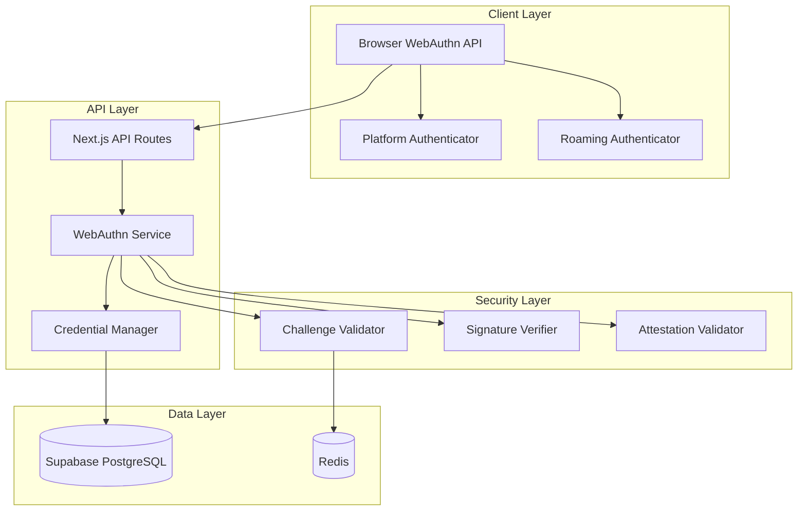

# Design Document: WebAuthn/Passkey Support

## Overview

WebAuthn/Passkey 支持为 ProtocolBanks 提供符合 FIDO2 标准的无密码认证能力。本设计集成现有的 Shamir 分片认证系统，提供生物识别登录、硬件密钥支持和交易授权功能。

### 设计目标

1. **安全性**: 符合 FIDO2/WebAuthn Level 2 标准
2. **易用性**: 一键登录，无需记忆密码
3. **兼容性**: 支持主流浏览器和平台
4. **可恢复性**: 提供安全的恢复机制

## Architecture

### 系统架构图



## Components and Interfaces

### 1. WebAuthn Service

```typescript
// lib/auth/webauthn.ts
interface WebAuthnService {
  // 注册流程
  generateRegistrationOptions(userId: string): Promise<RegistrationOptions>;
  verifyRegistration(userId: string, response: RegistrationResponse): Promise<VerifiedRegistration>;
  
  // 认证流程
  generateAuthenticationOptions(userId?: string): Promise<AuthenticationOptions>;
  verifyAuthentication(response: AuthenticationResponse): Promise<VerifiedAuthentication>;
  
  // 交易授权
  generateTransactionChallenge(tx: TransactionDetails): Promise<TransactionChallenge>;
  verifyTransactionAuthorization(challenge: string, response: AuthenticationResponse): Promise<AuthorizationToken>;
}

interface RegistrationOptions {
  challenge: string;  // Base64URL encoded
  rp: {
    name: string;
    id: string;
  };
  user: {
    id: string;
    name: string;
    displayName: string;
  };
  pubKeyCredParams: PublicKeyCredentialParameters[];
  timeout: number;
  attestation: AttestationConveyancePreference;
  authenticatorSelection: AuthenticatorSelectionCriteria;
}

interface VerifiedRegistration {
  credentialId: string;
  publicKey: string;
  counter: number;
  credentialType: 'platform' | 'cross-platform';
  transports?: AuthenticatorTransport[];
}
```

### 2. Credential Manager

```typescript
// lib/auth/credential-manager.ts
interface CredentialManager {
  // CRUD 操作
  storeCredential(userId: string, credential: StoredCredential): Promise<void>;
  getCredentials(userId: string): Promise<StoredCredential[]>;
  getCredentialById(credentialId: string): Promise<StoredCredential | null>;
  updateCredential(credentialId: string, updates: CredentialUpdate): Promise<void>;
  removeCredential(credentialId: string): Promise<void>;
  
  // 查询
  findCredentialsByWallet(walletAddress: string): Promise<StoredCredential[]>;
  getCredentialCount(userId: string): Promise<number>;
}

interface StoredCredential {
  id: string;
  credentialId: string;  // Base64URL encoded
  userId: string;
  walletAddress: string;
  publicKey: string;     // COSE format, Base64URL encoded
  counter: number;
  credentialType: 'platform' | 'cross-platform';
  transports?: string[];
  deviceName: string;
  createdAt: Date;
  lastUsedAt: Date;
}
```

### 3. Challenge Validator

```typescript
// lib/auth/challenge-validator.ts
interface ChallengeValidator {
  // 生成挑战
  generateChallenge(type: ChallengeType, metadata?: ChallengeMetadata): Promise<Challenge>;
  
  // 验证挑战
  validateChallenge(challengeId: string, response: string): Promise<ValidationResult>;
  
  // 过期管理
  isExpired(challengeId: string): Promise<boolean>;
  invalidate(challengeId: string): Promise<void>;
}

interface Challenge {
  id: string;
  value: string;        // 32 bytes, Base64URL encoded
  type: ChallengeType;
  metadata?: ChallengeMetadata;
  expiresAt: Date;
  createdAt: Date;
}

type ChallengeType = 'registration' | 'authentication' | 'transaction';

interface ChallengeMetadata {
  transactionId?: string;
  amount?: string;
  recipient?: string;
  tokenSymbol?: string;
}
```

### 4. Signature Verifier

```typescript
// lib/auth/signature-verifier.ts
interface SignatureVerifier {
  // 验证签名
  verifyAssertion(
    assertion: AuthenticatorAssertionResponse,
    publicKey: string,
    challenge: string,
    origin: string
  ): Promise<VerificationResult>;
  
  // 验证计数器
  validateCounter(credentialId: string, newCounter: number): Promise<boolean>;
}

interface VerificationResult {
  valid: boolean;
  error?: string;
  userVerified: boolean;
  newCounter: number;
}
```

## Data Models

### Database Schema

```sql
-- WebAuthn 凭证表
CREATE TABLE webauthn_credentials (
  id UUID PRIMARY KEY DEFAULT gen_random_uuid(),
  user_id UUID REFERENCES auth_users(id) ON DELETE CASCADE,
  wallet_address TEXT NOT NULL,
  credential_id TEXT NOT NULL UNIQUE,  -- Base64URL encoded
  public_key TEXT NOT NULL,            -- COSE format, Base64URL
  counter INTEGER NOT NULL DEFAULT 0,
  credential_type TEXT NOT NULL,       -- 'platform' | 'cross-platform'
  transports TEXT[],
  device_name TEXT NOT NULL,
  aaguid TEXT,                         -- Authenticator AAGUID
  created_at TIMESTAMPTZ DEFAULT NOW(),
  last_used_at TIMESTAMPTZ DEFAULT NOW(),
  
  CONSTRAINT valid_credential_type CHECK (credential_type IN ('platform', 'cross-platform'))
);

-- 挑战表 (短期存储，可用 Redis 替代)
CREATE TABLE webauthn_challenges (
  id UUID PRIMARY KEY DEFAULT gen_random_uuid(),
  challenge TEXT NOT NULL UNIQUE,
  type TEXT NOT NULL,
  user_id UUID REFERENCES auth_users(id),
  metadata JSONB,
  expires_at TIMESTAMPTZ NOT NULL,
  used BOOLEAN DEFAULT FALSE,
  created_at TIMESTAMPTZ DEFAULT NOW()
);

-- 认证尝试日志
CREATE TABLE webauthn_auth_attempts (
  id UUID PRIMARY KEY DEFAULT gen_random_uuid(),
  user_id UUID REFERENCES auth_users(id),
  credential_id TEXT,
  success BOOLEAN NOT NULL,
  error_code TEXT,
  ip_address INET,
  user_agent TEXT,
  created_at TIMESTAMPTZ DEFAULT NOW()
);

-- 恢复请求表
CREATE TABLE webauthn_recovery_requests (
  id UUID PRIMARY KEY DEFAULT gen_random_uuid(),
  user_id UUID REFERENCES auth_users(id),
  status TEXT DEFAULT 'pending',
  verification_method TEXT,
  cooling_period_ends_at TIMESTAMPTZ,
  created_at TIMESTAMPTZ DEFAULT NOW(),
  completed_at TIMESTAMPTZ
);

-- 索引
CREATE INDEX idx_credentials_user ON webauthn_credentials(user_id);
CREATE INDEX idx_credentials_wallet ON webauthn_credentials(wallet_address);
CREATE INDEX idx_challenges_expires ON webauthn_challenges(expires_at);
CREATE INDEX idx_auth_attempts_user ON webauthn_auth_attempts(user_id, created_at);

-- RLS 策略
ALTER TABLE webauthn_credentials ENABLE ROW LEVEL SECURITY;
ALTER TABLE webauthn_auth_attempts ENABLE ROW LEVEL SECURITY;

CREATE POLICY "Users can view own credentials" ON webauthn_credentials
  FOR SELECT USING (wallet_address = current_setting('app.current_user_address', true));

CREATE POLICY "Users can manage own credentials" ON webauthn_credentials
  FOR ALL USING (wallet_address = current_setting('app.current_user_address', true));
```

## Correctness Properties

*A property is a characteristic or behavior that should hold true across all valid executions of a system—essentially, a formal statement about what the system should do.*

### Property 1: Challenge Uniqueness and Randomness

*For any* two challenges generated by the system, their values SHALL be unique and each challenge SHALL contain exactly 32 bytes of cryptographic randomness.

**Validates: Requirements 1.1, 2.1**

### Property 2: Credential Storage Integrity

*For any* successfully registered credential, the stored record SHALL contain a valid public key and be associated with exactly one wallet address.

**Validates: Requirements 1.2, 1.4**

### Property 3: Registration Error Handling

*For any* failed registration attempt, the response SHALL contain a standardized error code from the defined set of WebAuthn error codes.

**Validates: Requirements 1.5**

### Property 4: Multiple Passkey Support

*For any* user, the system SHALL allow registration of multiple credentials, and all registered credentials SHALL be usable for authentication.

**Validates: Requirements 1.6**

### Property 5: Signature Verification

*For any* authentication assertion, the signature verification SHALL correctly validate against the stored public key using the COSE algorithm specified during registration.

**Validates: Requirements 2.2**

### Property 6: Token/Challenge Expiration

*For any* challenge older than 5 minutes or authorization token older than 60 seconds, the system SHALL reject it as expired.

**Validates: Requirements 2.3, 3.4**

### Property 7: Session Creation on Auth

*For any* successful authentication, the system SHALL create a valid session with appropriate privileges.

**Validates: Requirements 2.4**

### Property 8: Rate Limiting and Lockout

*For any* user with 5 consecutive failed authentication attempts, the account SHALL be locked for 15 minutes, and rate limiting SHALL be enforced on all authentication endpoints.

**Validates: Requirements 2.5, 6.6**

### Property 9: Transaction Threshold Enforcement

*For any* transaction exceeding the configured threshold (default $1,000), the system SHALL require Passkey verification before execution.

**Validates: Requirements 3.1, 3.6**

### Property 10: Transaction Details in Challenge

*For any* transaction authorization challenge, the challenge metadata SHALL contain the transaction amount, recipient address, and token symbol.

**Validates: Requirements 3.2**

### Property 11: Failed Verification Handling

*For any* failed Passkey verification for a transaction, the transaction SHALL be rejected and an audit log entry SHALL be created.

**Validates: Requirements 3.5**

### Property 12: Credential Listing Completeness

*For any* credential listing request, the response SHALL include device name, registration date, last used date, and authenticator type for each credential.

**Validates: Requirements 4.1, 4.6**

### Property 13: Credential Removal Verification

*For any* credential removal request, the system SHALL require verification with another authentication method before proceeding.

**Validates: Requirements 4.2**

### Property 14: Last Credential Protection

*For any* user with only one credential and no other authentication method, the system SHALL prevent removal of that credential.

**Validates: Requirements 4.3**

### Property 15: Session Invalidation on Removal

*For any* credential removal, all active sessions that were authenticated using that credential SHALL be invalidated.

**Validates: Requirements 4.4**

### Property 16: Recovery Verification Required

*For any* Passkey reset request, the system SHALL require identity verification before allowing the reset.

**Validates: Requirements 5.2**

### Property 17: Recovery Cooling Period

*For any* newly registered credential after recovery, the credential SHALL NOT be usable until 24 hours have passed.

**Validates: Requirements 5.4**

### Property 18: Suspicious Recovery Detection

*For any* recovery attempt matching suspicious patterns (multiple attempts, unusual location), the system SHALL require additional verification.

**Validates: Requirements 5.5**

### Property 19: Origin Validation

*For any* WebAuthn ceremony, the system SHALL verify that the origin matches the expected domain and reject mismatched origins.

**Validates: Requirements 6.1**

### Property 20: User Verification Flag

*For any* sensitive operation (transaction authorization, credential removal), the system SHALL require the user verification (UV) flag to be set.

**Validates: Requirements 6.2**

### Property 21: Attestation Validation

*For any* registration with attestation, the system SHALL validate the attestation certificate chain against known root CAs.

**Validates: Requirements 6.3**

### Property 22: Counter Replay Protection

*For any* authentication assertion, if the counter value is less than or equal to the stored counter, the system SHALL reject the assertion.

**Validates: Requirements 6.4**

### Property 23: No Private Key Storage

*For any* stored credential, the record SHALL contain only the public key and SHALL NOT contain any private key material.

**Validates: Requirements 6.5**

### Property 24: Audit Logging

*For any* authentication event or recovery attempt, the system SHALL create an audit log entry with timestamp, user ID, and result.

**Validates: Requirements 5.6, 6.7**

## Error Handling

### Error Code System

```typescript
// lib/auth/webauthn-errors.ts
enum WebAuthnErrorCode {
  // Registration Errors (1xxx)
  REGISTRATION_FAILED = 'WEBAUTHN_1001',
  INVALID_ATTESTATION = 'WEBAUTHN_1002',
  UNSUPPORTED_ALGORITHM = 'WEBAUTHN_1003',
  CREDENTIAL_EXISTS = 'WEBAUTHN_1004',
  
  // Authentication Errors (2xxx)
  AUTHENTICATION_FAILED = 'WEBAUTHN_2001',
  INVALID_SIGNATURE = 'WEBAUTHN_2002',
  CREDENTIAL_NOT_FOUND = 'WEBAUTHN_2003',
  CHALLENGE_EXPIRED = 'WEBAUTHN_2004',
  CHALLENGE_MISMATCH = 'WEBAUTHN_2005',
  COUNTER_INVALID = 'WEBAUTHN_2006',
  ACCOUNT_LOCKED = 'WEBAUTHN_2007',
  
  // Authorization Errors (3xxx)
  AUTHORIZATION_REQUIRED = 'WEBAUTHN_3001',
  AUTHORIZATION_FAILED = 'WEBAUTHN_3002',
  TOKEN_EXPIRED = 'WEBAUTHN_3003',
  
  // Credential Management Errors (4xxx)
  REMOVAL_DENIED = 'WEBAUTHN_4001',
  LAST_CREDENTIAL = 'WEBAUTHN_4002',
  VERIFICATION_REQUIRED = 'WEBAUTHN_4003',
  
  // Recovery Errors (5xxx)
  RECOVERY_DENIED = 'WEBAUTHN_5001',
  COOLING_PERIOD_ACTIVE = 'WEBAUTHN_5002',
  SUSPICIOUS_ACTIVITY = 'WEBAUTHN_5003',
  
  // Security Errors (6xxx)
  ORIGIN_MISMATCH = 'WEBAUTHN_6001',
  UV_REQUIRED = 'WEBAUTHN_6002',
  RATE_LIMITED = 'WEBAUTHN_6003',
}
```

## Testing Strategy

### Unit Tests

- Challenge generation randomness
- Signature verification with test vectors
- Counter validation logic
- Expiration time calculations
- Error code mapping

### Property-Based Tests

Using `fast-check` library:

```typescript
import fc from 'fast-check';

// Property 1: Challenge Uniqueness
describe('Challenge Generation', () => {
  it('should generate unique 32-byte challenges', () => {
    fc.assert(
      fc.property(fc.integer({ min: 100, max: 1000 }), (count) => {
        const challenges = new Set();
        for (let i = 0; i < count; i++) {
          const challenge = generateChallenge();
          // Verify 32 bytes (256 bits) when decoded
          const decoded = Buffer.from(challenge, 'base64url');
          if (decoded.length !== 32) return false;
          challenges.add(challenge);
        }
        return challenges.size === count;
      }),
      { numRuns: 100 }
    );
  });
});

// Property 22: Counter Replay Protection
describe('Counter Validation', () => {
  it('should reject lower or equal counters', () => {
    fc.assert(
      fc.property(
        fc.integer({ min: 0, max: 1000000 }),
        fc.integer({ min: 0, max: 1000000 }),
        (storedCounter, newCounter) => {
          const result = validateCounter(storedCounter, newCounter);
          return result === (newCounter > storedCounter);
        }
      ),
      { numRuns: 100 }
    );
  });
});
```

### Integration Tests

- Full registration flow with mock authenticator
- Full authentication flow
- Transaction authorization flow
- Credential management operations
- Recovery flow

### Test Configuration

- Property tests: minimum 100 iterations
- Test tag format: `Feature: webauthn-passkey, Property N: {property_text}`
- Use @simplewebauthn/server for WebAuthn operations
