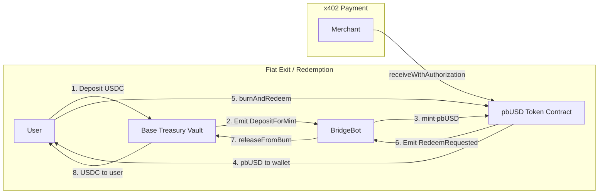

# HashKey Chain Integration & pbUSD System

> **Version**: 2.0.0 | **Last Updated**: 2025-02-08  
> **Solidity**: 0.8.20 | **OpenZeppelin**: 5.0.1

---

## 1. Overview

Protocol Bank supports **HashKey Chain (HSK)** as a specialized liquidity layer for RWA (Real World Asset) settlement and large-scale fiat exits. While Base and Arbitrum utilize standard stablecoins (USDC/USDT) for corporate batch payments, HashKey is utilized primarily for **Compliance-First Fiat Off-ramping**.

| Feature | Details |
| :--- | :--- |
| **Chain ID** | `177` (Mainnet) / `133` (Testnet) |
| **Native Token** | `HSK` |
| **Primary Use Case** | RWA Settlement, Exchange Deposits, Fiat Withdrawals |
| **Stablecoin Model** | **pbUSD** (Synthetic, 1:1 backed by Base USDC) |
| **Token Standard** | ERC-20 + ERC-2612 (Permit) + ERC-3009 (Auth) |
| **Decimals** | **6** (Matches USDC) |

---

## 2. The pbUSD Stablecoin System

### 2.1 Problem & Solution

HashKey Chain currently lacks native liquidity for major stablecoins (USDC/USDT). To solve this without relying on fragmented third-party bridges, Protocol Bank implements **pbUSD (Protocol Bank USD)**.

*   **Type**: Synthetic Stablecoin (Mint-and-Burn).
*   **Backing**: 100% backed by USDC held in the **Protocol Bank Treasury** on Base Chain.
*   **Decimals**: **6** (To maintain 1:1 unit parity with USDC).
*   **Peg**: 1 pbUSD = 1 USDC.

### 2.2 System Architecture



### 2.3 Smart Contract Specifications

#### A. ProtocolBankUSD (HashKey Chain)

The user-facing token on HashKey Chain. Implements a comprehensive set of DeFi standards and security controls.

**Standards**:
| Standard | Description |
| :--- | :--- |
| ERC-20 | Base fungible token standard |
| ERC-2612 | `permit()` - Gasless approvals via off-chain signatures |
| ERC-3009 | `transferWithAuthorization()` / `receiveWithAuthorization()` - x402 compatible |

**Access Control Roles**:
| Role | Description | Typical Holder |
| :--- | :--- | :--- |
| `DEFAULT_ADMIN_ROLE` | Global admin, can grant/revoke all roles | Multi-sig |
| `MINTER_ROLE` | Mint new pbUSD upon verified USDC deposit | Bridge Bot |
| `PAUSER_ROLE` | Emergency pause/unpause all transfers | Ops Team |
| `COMPLIANCE_ROLE` | Blacklist/unblacklist addresses | Compliance Officer |
| `FEE_MANAGER_ROLE` | Set transfer fee rate and fee collector | Admin |

**Security Features**:

| Feature | Description | Config |
| :--- | :--- | :--- |
| **Daily Mint Cap** | Limits total minting per 24h period. Prevents unlimited minting if bridge bot key is compromised. | Configurable by admin. Resets automatically at UTC midnight. |
| **Transfer Fee** | Optional protocol fee on transfers (default 0). Fee deducted from transfer amount and sent to `feeCollector`. | 0 – 50 basis points (0% – 0.50%). Fee-exempt addresses supported. |
| **Blacklist** | Blocks transfers from/to sanctioned addresses. Required for compliance with RWA regulations. | Managed by `COMPLIANCE_ROLE`. |
| **Pausable** | Emergency circuit breaker freezes all minting, burning, and transfers. | `PAUSER_ROLE` can pause; `PAUSER_ROLE` can unpause. |

**Key Functions**:
```solidity
// Minting (Bridge Bot only)
function mint(address to, uint256 amount) external onlyRole(MINTER_ROLE);

// Burn & Redeem (any user)
function burnAndRedeem(uint256 amount, address baseRecipient) external;

// ERC-3009: Gasless Transfer (x402 compatible)
function transferWithAuthorization(
    address from, address to, uint256 value,
    uint256 validAfter, uint256 validBefore, bytes32 nonce,
    uint8 v, bytes32 r, bytes32 s
) external;

function receiveWithAuthorization(
    address from, address to, uint256 value,
    uint256 validAfter, uint256 validBefore, bytes32 nonce,
    uint8 v, bytes32 r, bytes32 s
) external;

function cancelAuthorization(bytes32 nonce, uint8 v, bytes32 r, bytes32 s) external;

// View
function circulatingSupply() external view returns (uint256);
function remainingDailyMint() external view returns (uint256);
function DOMAIN_SEPARATOR() external view returns (bytes32);
```

**Custom Errors** (gas-efficient):
```solidity
error SenderBlacklisted(address account);
error RecipientBlacklisted(address account);
error DailyMintCapExceeded(uint256 requested, uint256 remaining);
error FeeTooHigh(uint256 requested, uint256 max);
error AuthorizationAlreadyUsed(address authorizer, bytes32 nonce);
error AuthorizationExpired(uint256 deadline);
error InvalidSignature();
error CallerNotPayee();
```

#### B. ProtocolBankTreasury (Base Chain)

The USDC vault holding the 1:1 backing collateral on Base.

**Access Control Roles**:
| Role | Description | Typical Holder |
| :--- | :--- | :--- |
| `DEFAULT_ADMIN_ROLE` | Global admin, can update caps and cancel emergencies | Multi-sig |
| `RELAYER_ROLE` | Release USDC upon verified pbUSD burn | Bridge Bot |
| `GUARDIAN_ROLE` | Emergency pause and request emergency withdrawals | Security Team |

**Security Features**:

| Feature | Description |
| :--- | :--- |
| **Daily Release Cap** | Limits total USDC released per 24h. Prevents vault drain if relayer key is compromised. |
| **Burn TX Idempotency** | Each `burnTxHash` can only be processed once, preventing double-release attacks. |
| **Emergency Timelock** | Emergency withdrawals require a time-locked request + execution flow (default: 48h mainnet, 1h testnet). |
| **ReentrancyGuard** | All fund-moving functions protected against reentrancy attacks. |
| **Pausable** | `GUARDIAN_ROLE` can pause. Only `DEFAULT_ADMIN_ROLE` can unpause (separation of concerns). |

**Key Functions**:
```solidity
// Deposit (any user)
function depositToHashKey(uint256 amount, address hashKeyRecipient) external;

// Release (Bridge Bot only)
function releaseFromBurn(address recipient, uint256 amount, bytes32 burnTxHash)
    external onlyRole(RELAYER_ROLE);

// Emergency (Guardian)
function requestEmergencyWithdraw(address to, uint256 amount) external onlyRole(GUARDIAN_ROLE);
function executeEmergencyWithdraw(address to, uint256 amount, bytes32 requestHash)
    external onlyRole(GUARDIAN_ROLE);
function cancelEmergencyWithdraw(bytes32 requestHash) external onlyRole(DEFAULT_ADMIN_ROLE);

// View
function vaultBalance() external view returns (uint256);
function netDeposited() external view returns (uint256);
function remainingDailyRelease() external view returns (uint256);
function isBurnProcessed(bytes32 burnTxHash) external view returns (bool);
```

---

## 3. Integration & Usage

### 3.1 For Developers

**Contract Addresses**

| Contract | Chain | Network | Address |
| :--- | :--- | :--- | :--- |
| ProtocolBankUSD | HashKey | Mainnet (177) | `Pending Deployment` |
| ProtocolBankUSD | HashKey | Testnet (133) | `Pending Deployment` |
| ProtocolBankTreasury | Base | Mainnet (8453) | `Pending Deployment` |
| ProtocolBankTreasury | Base | Testnet (84532) | `Pending Deployment` |

**USDC Addresses**:
- Base Mainnet: `0x833589fCD6eDb6E08f4c7C32D4f71b54bdA02913`
- Base Sepolia: `0x036CbD53842c5426634e7929541eC2318f3dCF7e`

**Deployment**:
```bash
# Deploy to HashKey Testnet
npx hardhat run scripts/deploy_pbusd.ts --network hashkeyTestnet

# Deploy to Base Sepolia
npx hardhat run scripts/deploy_pbusd.ts --network baseSepolia

# Local development (deploys all + MockUSDC)
npx hardhat run scripts/deploy_pbusd.ts --network localhost
```

**Bridge Controller**:
The off-chain worker monitors both chains:
*   Listens for `DepositForMint` on Base → calls `mint()` on HashKey.
*   Listens for `RedeemRequested` on HashKey → calls `releaseFromBurn()` on Base.

### 3.2 ERC-3009 / x402 Integration

pbUSD implements **ERC-3009** for gasless payment authorization, making it compatible with the **x402 HTTP Payment Protocol**:

```typescript
// Example: Sign a transferWithAuthorization off-chain
const domain = {
  name: "Protocol Bank USD",
  version: "1",
  chainId: 177, // HashKey mainnet
  verifyingContract: PBUSD_ADDRESS,
};

const types = {
  TransferWithAuthorization: [
    { name: "from", type: "address" },
    { name: "to", type: "address" },
    { name: "value", type: "uint256" },
    { name: "validAfter", type: "uint256" },
    { name: "validBefore", type: "uint256" },
    { name: "nonce", type: "bytes32" },
  ],
};

const sig = await signer.signTypedData(domain, types, {
  from: signer.address,
  to: merchantAddress,
  value: ethers.parseEther("100"),
  validAfter: 0,
  validBefore: Math.floor(Date.now() / 1000) + 3600,
  nonce: ethers.randomBytes(32),
});
```

### 3.3 Feature Flags (Frontend)

The frontend (`app/(products)/batch-payment/page.tsx`) explicitly **blocks** batch payments on HashKey to guide users toward the correct use case:

> "Corporate batch transfers are not available on HashKey Chain... HashKey Chain is currently optimized for RWA and large fiat withdrawals only using pbUSD."

### 3.4 Security & Compliance

1.  **Role Separation**: Minter, Relayer, Pauser, Compliance, and Fee Manager are independent roles.
2.  **Daily Caps**: Both minting (HashKey) and releasing (Base) are rate-limited per day.
3.  **Emergency Pause**: Guardian can pause either contract immediately.
4.  **Emergency Withdrawal**: Time-locked process requires request → wait → execute (admin can cancel).
5.  **Blacklist**: Sanctioned addresses can be frozen at the contract level.
6.  **Burn Idempotency**: Each burn transaction can only trigger one USDC release.
7.  **Custom Errors**: Gas-efficient error handling with descriptive revert reasons.

---

## 4. Test Coverage

The contract suite includes **58 tests** covering:

| Category | Tests | Coverage |
| :--- | :--- | :--- |
| Deployment | 8 | Roles, caps, initial state |
| Minting | 5 | Happy path, access control, zero checks |
| Daily Mint Cap | 5 | Enforcement, reset, update, remaining |
| Burn & Redeem | 5 | Events, tracking, validation |
| Blacklist | 4 | Add, remove, sender/receiver blocking |
| Pause | 6 | Pause, unpause, transfer/mint/deposit blocking |
| Transfer Fee | 4 | Fee deduction, exemption, max cap, zero fee |
| ERC-3009 | 3 | transferWithAuth, nonce reuse, cancelAuth |
| Treasury Deposit | 4 | Happy path, tracking, validation |
| Treasury Release | 6 | Release, idempotency, cap, reset, balance, auth |
| Emergency Withdrawal | 2 | Timelock flow, cancel |
| View Functions | 4 | Balance, net deposit, remaining release, burn check |
| Full Bridge Flow | 1 | End-to-end deposit→mint→burn→release cycle |

**Run tests**:
```bash
cd contracts
npx hardhat test
```

---

## 5. Deployment Strategy

### Phase 1 — Testnet
1.  Deploy `ProtocolBankTreasury` to Base Sepolia
2.  Deploy `ProtocolBankUSD` to HashKey Testnet
3.  Run bridge controller locally
4.  Run full integration tests

### Phase 2 — Security Audit
1.  Internal code review of both contracts
2.  Third-party audit of `ProtocolBankTreasury.sol` (holds real USDC)
3.  Formal verification of mint cap and release cap logic

### Phase 3 — Mainnet
1.  Deploy to Base Mainnet & HashKey Mainnet
2.  Transfer admin roles to multi-sig wallet
3.  Configure bridge relayer with MPC wallet
4.  Set production daily caps (5M pbUSD / 5M USDC)
5.  Set emergency withdrawal delay to 48 hours
6.  Enable frontend RWA features
7.  Monitor via event indexer + alerts

---

## 6. Configuration Reference

### Mainnet Defaults
```
Daily Mint Cap:           5,000,000 pbUSD
Daily Release Cap:        5,000,000 USDC
Transfer Fee:             0 bps (disabled)
Max Transfer Fee:         50 bps (0.50%)
Emergency Withdrawal Delay: 172,800s (48 hours)
```

### Testnet Defaults
```
Daily Mint Cap:           1,000,000 pbUSD
Daily Release Cap:        1,000,000 USDC
Transfer Fee:             0 bps (disabled)
Emergency Withdrawal Delay: 3,600s (1 hour)
```

---

## 5. Previous Documentation
*Replaces content from deprecated `PBUSD_DESIGN.md`.*
