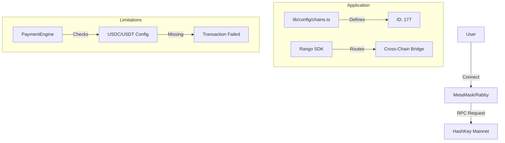

# HashKey Chain Integration

## 1. Overview
Protocol Bank supports **HashKey Chain (HSK)** as a primary EVM-compatible layer for regulatory-compliant DeFi interactions. The chain is integrated into the multi-chain wallet adapter and routing engines but is currently limited by missing stablecoin infrastructure.

**ID**: `177`  
**Native Token**: `HSK`  
**RPC Endpoint**: `https://mainnet.hsk.xyz`  

**Current Status:** 🟡 Configured (Connectivity Only)
- ✅ Network Configuration (Chain ID 177)
- ✅ Wallet Connection (EVM Standard)
- ✅ Cross-Chain Routing (Rango/ZetaChain)
- 🟡 Stablecoin Support (Contracts pending official HashKey deployment or [pbUSD Solution](PBUSD_DESIGN.md))

---

## 2. Architecture

### 2.1 Integration Strategy
HashKey is treated as a standard EVM chain within the architecture. It requires no specialized adapters (unlike Tron or Solana) and utilizes the existing `viem` and `wagmi` libraries.

*   **Configuration**: Defined in `lib/constants.ts` and `lib/config/chains.ts`.
*   **Cross-Chain**: Integrated via **Rango Exchange SDK** and **ZetaChain** interoperability layer, allowing users to swap assets from any chain into HashKey.

### 2.2 Component Diagram

---

## 3. Features Implemented

| Feature | Details | Status |
| :--- | :--- | :--- |
| **Connectivity** | Standard EVM connection via Reown AppKit. | ✅ Ready |
| **Native Asset** | Native `HSK` token balance display and transfer. | ✅ Ready |
| **Cross-Chain Swap** | Incoming swaps supported via Rango (e.g., ETH -> HSK). | ✅ Ready |
| **Gas Estimation** | Standard EIP-1559 gas estimation works out-of-the-box. | ✅ Ready |
| **Stablecoin Pay** | Sending USDC/USDT on HashKey. | ❌ Blocked |

---

## 4. Technical Debt & Roadblocks

### 4.1 Missing Infrastructure
- **Stablecoin Contracts**:
  - File: `lib/constants.ts`
  - **Issue**: The `USDC` and `USDT` contract addresses for Chain 177 are empty/null.
  - **Impact**: Users cannot create Invoices or payments on HashKey chain, as the platform defaults to stablecoin settlement.

### 4.2 Configuration Gaps
- **Explorers**:
  - The block explorer URL is generic. Needs to be standardized to HashKey's official scanner for transaction linking.
- **Testnet**:
  - No configuration exists for HashKey Testnet. Development is currently forced to run against Mainnet or mock.

### 4.3 Next Steps
1.  **Deploy/Verify Token Contracts**: Obtain official bridged USDC/USDT addresses on HashKey.
2.  **Update Constants**: Populate `USDC_ADDRESS[177]` in `lib/constants.ts`.
3.  **Enable Testnet**: Add HashKey Testnet (Chain ID 133) to `lib/config/chains.ts` for safe testing.
